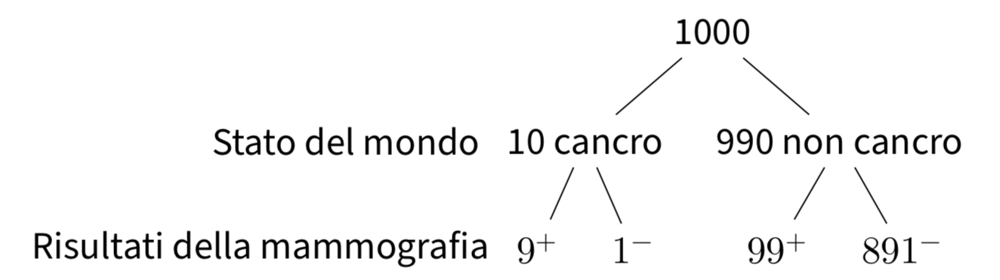

# Probabilità condizionata {#chapter-prob-cond}

```{r setup, include = FALSE}
source("_common.R")
```

::: {.chapterintro data-latex=""}
L'attribuzione di una probabilità ad un evento è sempre condizionata dalle conoscenze che abbiamo a disposizione. Per un determinato stato di conoscenze, attribuiamo ad un dato evento una certa probabilità di verificarsi; ma se il nostro stato di conoscenze cambia, allora cambierà anche la probabilità che attribuiamo all'evento in questione. 
:::

<!-- Possiamo chiederci, ad esempio, quale sia la probabilità che Mario Rossi superi l'esame di Psicometria nel primo appello del presente anno accademico. In assenza di altre informazioni, la migliore stima di tale probabilità è data dalla proporzione di studenti che hanno superato l'esame di Psicometria nel corrispondente appello dei precedenti anni accademici. Ma se sappiamo che Mario Rossi è particolarmente motivato  ed ha studiato molto, allora la probabilità sarà sicuramente più alta. -->


## Probabilità condizionata su altri eventi 

La probabilità condizionata è una componente essenziale del ragionamento scientifico dato che chiarisce come sia possibile incorporare le evidenze disponibili, in maniera logica e coerente, nella nostra conoscenza del mondo. Infatti, si può pensare che tutte le probabilità siano probabilità condizionate, anche se l'evento condizionante non è sempre esplicitamente menzionato. Consideriamo il seguente problema.

::: {.example}
Supponiamo che lo screening per la diagnosi precoce del tumore mammario si avvalga di test che sono accurati al 90%, nel senso che il 90% delle donne con cancro e il 90% delle donne senza cancro saranno classificate correttamente. Supponiamo che l'1% delle donne sottoposte allo screening abbia effettivamente il cancro al seno. Ci chiediamo: qual è la probabilità che una donna scelta casualmente abbia una mammografia positiva e, se ce l'ha, qual è la probabilità che abbia davvero il cancro?

Per risolvere questo problema, supponiamo che il test in questione venga somministrato ad un grande campione di donne, diciamo a 1000 donne. Di queste 1000 donne, 10 (ovvero, l'1%) hanno il cancro al seno. Per queste 10 donne, il test darà un risultato positivo in 9 casi (ovvero, nel 90% dei casi). Per le rimanenti 990 donne che non hanno il cancro al seno, il test darà un risultato positivo in 99 casi (se la probabilità di un vero positivo è del 90%, la probabilità di un falso positivo è del 10%). Questa situazione è rappresentata nella figura \@ref(fig:mammografia). Combinando questi due risultati, vediamo che il test dà un risultato positivo per 9 donne che hanno effettivamente il cancro al seno e per 99 donne che non ce l'hanno, per un totale di 108 risultati positivi. Dunque, la probabilità di ottenere un risultato positivo al test è $\frac{108}{1000}$ = 11%. Ma delle 108 donne che hanno ottenuto un risultato positivo al test, solo 9 hanno il cancro al seno. Dunque, la probabilità di avere il cancro, dato un risultato positivo al test, è pari a $\frac{9}{108}$ = 8%.

```{r mammografia, echo=FALSE, fig.cap="Rappresentazione ad albero che riporta le frequenze attese dei risultati di una mammografia in un campione di 1,000 donne.", out.width = '90%'}

```
::: 

Nell'esercizio precedente, la probabilità dell'evento "ottenere un risultato positivo al test" è una probabilità non condizionata, mentre la probabilità dell'evento "avere il cancro al seno, dato che il test ha dato un risultato positivo" è una probabilità condizionata. In termini generali, la probabilità condizionata $P(A \mid B)$ rappresenta la probabilità che si verifichi l'evento $A$ sapendo che si è verificato l'evento $B$ (oppure: la probabilità di $A$ in una prova valida solo se si verifica anche $B$). Ciò ci conduce alla seguente definizione.

```{definition, prob-cond}
Dato un qualsiasi evento $A$, si chiama *probabilità condizionata* di
$A$ dato $B$ il numero
\begin{equation}
P(A \mid B) = \frac{P(A \cap B)}{P(B)}, \quad \text{con}\, P(B) > 0,
(\#eq:probcond)
\end{equation}
dove $P(A\cap B)$ è la probabilità congiunta dei
due eventi, ovvero la probabilità che si verifichino entrambi.
```

In alcuni casi può essere conveniente leggere al contrario la \@ref(def:prob-cond) e utilizzarla per calcolare la probabilità dell'intersezione di due eventi. Per esempio se conosciamo la probabilità dell'evento $B$ e la probabilità condizionata di $A$ su $B$, otteniamo 
\begin{equation}
P(A \cap B) = P(B)P(A \mid B),
(\#eq:probcondinv)
\end{equation}
\noindent
mentre se conosciamo la probabilità dell'evento $A$ e la probabilità condizionata di $B$ su $A$, otteniamo 
$$
P(A \cap B) = P(A)P(B \mid A).
$$

::: {.example}
Da un mazzo di 52 carte (13 carte per ciascuno dei 4 semi) ne viene estratta 1 in modo casuale. Qual è la probabilità che esca una figura di cuori? Sapendo che la carta estratta ha il seme di cuori, qual è la probabilità che il valore numerico della carta sia 7, 8 o 9?

Ci sono 13 carte di cuori, dunque la risposta alla prima domanda è 1/4. Per rispondere alla seconda domanda consideriamo solo le 13 carte di cuori; la probabilità cercata è dunque 3/13.
::: 


### La fallacia del pubblico ministero

Un errore comune che si commette è quello di credere che $P(A \mid B)$ sia uguale a $P(B \mid A)$. Tale fallacia ha particolare risalto in ambito forense tanto che è conosciuta con il nome di "fallacia del procuratore" (*prosecutor's fallacy*). In essa, una piccola probabilità dell'evidenza, data l'innocenza, viene erroneamente interpretata come la probabilità dell'innocenza, data l'evidenza.

Consideriamo il caso di un esame del DNA. Un esperto forense potrebbe affermare, ad esempio, che "se l'imputato è innocente, c'è solo una possibilità su un miliardo che vi sia una corrispondenza tra il suo DNA e il DNA trovato sulla scena del crimine". Ma talvolta questa probabilità è erroneamente interpretata come avesse il seguente significato: "date le prove del DNA, c'è solo una possibilità su un miliardo che l'imputato sia innocente".

Le considerazioni precedenti risultano più chiare se facciamo nuovamente riferimento all'esercizio sul tumore mammario descritto sopra. In tale esercizio abbiamo visto come la probabilità di cancro dato un risultato positivo al test sia uguale a 0.08. Tale probabilità è molto diversa dalla probabilità di un risultato positivo al test data la presenza del cancro. Infatti, questa seconda
probabilità è uguale a 0.90 ed è descritta nel problema come una delle
caratteristiche del test in questione.


## Legge della probabilità composta

Il teorema della probabilità composta deriva dal concetto di probabilità condizionata per cui la probabilità che si verifichino due eventi $A_i$ e $A_j$ è pari alla probabilità di uno dei due eventi moltiplicato con la probabilità dell'altro evento condizionato al verificarsi del primo.

L'equazione \@ref(eq:probcondinv) si estende al caso di $n$ eventi $A_1, \dots, A_n$ nella forma seguente: 
\begin{equation}
\begin{split}
P(A_1 \cap A_2 \cap \dots\cap A_n) = {}& P(A_1)P(A_2 \mid A_1)P(A_3 \mid A_1 \cap A_2) \dots\\
 & P(A_n \mid A_1 \cap A_2 \cap \dots \cap A_{n-1})
\end{split}
(\#eq:probcomposte)
\end{equation}
la quale esprime in forma generale la legge della probabilità composta.

::: {.example}
Da un'urna contenente 6 palline bianche e 4 nere si estrae una pallina
per volta, senza reintrodurla nell'urna. Indichiamo con $B_i$ l'evento:
"esce una pallina bianca alla $i$-esima estrazione" e con $N_i$
l'estrazione di una pallina nera. L'evento: "escono due palline bianche
nelle prime due estrazioni" è rappresentato dalla intersezione
$\{B_1 \cap  B_2\}$ e la sua probabilità vale, per la \@ref(eq:probcondinv) 
$$
P(B_1 \cap B_2) = P(B_1)P(B_2 \mid B_1).
$$
$P(B_1)$ vale 6/10, perché nella prima estrazione $\Omega$ è costituito da 10 elementi: 6 palline bianche e 4 nere. La probabilità condizionata $P(B_2 \mid B_1)$ vale 5/9, perché nella seconda estrazione, se è verificato l'evento $B_1$, lo spazio campionario consiste di 5 palline bianche e 4 nere. Si ricava
pertanto:
$$
  P(B_1 \cap B_2) = \frac{6}{10} \cdot \frac{5}{9} = \frac{1}{3}.
$$ 
In modo analogo si ha che
$$
P(N_1 \cap N_2) = P(N_1)P(N_2 \mid N_1) = \frac{4}{10} \cdot \frac{3}{9} = \frac{4}{30}.
$$

Se l'esperimento consiste nell'estrazione successiva di 3 palline, la probabilità che queste siano tutte bianche vale, per la \@ref(eq:probcomposte):
$$
P(B_1 \cap B_2 \cap B_3)=P(B_1)P(B_2 \mid B_1)P(B_3 \mid B_1 \cap B_2),
$$
dove la probabilità $P(B_3 \mid B_1 \cap B_2)$ si calcola supponendo che si sia verificato l'evento condizionante $\{B_1 \cap B_2\}$. Lo spazio campionario per questa probabilità condizionata è costituito da 4 palline bianche e 4 nere, per cui $P(B_3 \mid B_1 \cap B_2) = 1/2$ e quindi:
$$
P (B_1 \cap B_2 \cap B_3) = \frac{6}{10}\cdot\frac{5}{9} \cdot\frac{4}{8}  = \frac{1}{6}.
$$

La probabilità dell'estrazione di tre palline nere è invece:
$$
\begin{aligned}
P(N_1 \cap N_2 \cap N_3) &= P(N_1)P(N_2 \mid N_1)P(N_3 \mid N_1 \cap N_2)\notag\\ 
&= \frac{4}{10} \cdot \frac{3}{9} \cdot \frac{2}{8} = \frac{1}{30}.\notag
\end{aligned}
$$
::: 


## L'indipendendenza stocastica

Un concetto molto importante per le applicazioni statistiche della probabilità è quello dell'indipendenza stocastica. La definizione \@ref(eq:probcond) esprime il concetto intuitivo di indipendenza di un evento da un altro, nel senso che il verificarsi di $A$ non influisce sulla probabilità del verificarsi di $B$, ovvero non la condiziona. Infatti, per la definizione \@ref(eq:probcond) di probabilità condizionata, si ha che, se $A$ e $B$ sono due eventi indipendenti, risulta:
$$
P(A \mid B) = \frac{P(A)P(B)}{P(B)} = P(A).\notag
$$ 
Possiamo dunque dire che due eventi $A$ e $B$ sono indipendenti se 
$$
\begin{split}
P(A \mid B) &= P(A), \\
P(B \mid A) &= P(B).
\end{split}
$$

::: {.example}
Nel lancio di due dadi non truccati, si considerino gli eventi: _A_ = {esce un 1 o un 2 nel primo lancio} e _B_ = {il punteggio totale è 8}. Gli eventi _A_ e _B_ sono indipendenti?
::: 

Rappresentiamo qui sotto lo spazio campionario dell'esperimento casuale.

```{r sampling-space-dice, echo=FALSE, out.width = '50%', fig.cap="Rappresentazione dello spazio campionario dei risultati dell'esperimento casuale corrispondente al lancio di due dadi bilanciati. Sono evidenziati gli eventi elementari che costituiscono l'evento A: esce un 1 o un 2 nel primo lancio."}
knitr::include_graphics("images/sampling-space-dice.png")
```

Gli eventi _A_ e _B_ non sono statisticamente indipendenti. Infatti, le loro probabilità valgono _P_(A) = 12/36 e _P_(B) = 5/36 e la probabilità della loro intersezione è
$$
P(A \cap B) = 1/36 = 3/108 \neq P(A)P(B) = 5/108.
$$

::: {.rmdnote}
Si noti che il concetto di indipendenza è del tutto differente da quello di incompatibilità. Due eventi _A_ e _B_ incompatibili (per i quali si ha $A \cap B = \emptyset$) sono statisticamente dipendenti, poiché il verificarsi dell'uno esclude il verificarsi dell'altro: $P(A \cap B)=0  \neq P(A)P(B)$.
::: 

Si noti inoltre che, se due eventi con probabilità non nulla sono statisticamente indipendenti, la legge delle probabilità totali espressa dalla \@ref(eq:probunione) 
\begin{equation}
P(A \cup B) = P(A) + P(B) - P(A \cap B)
(\#eq:probunione)
\end{equation}
\noindent
si modifica nella relazione seguente:
\begin{equation}
P(A \cup B) = P(A) + P(B) - P(A)P(B).
\end{equation}


## Considerazioni conclusive {-}

La probabilità condizionata è importante perché ci fornisce uno strumento per precisare il concetto di indipendenza statistica. Una delle domande più importanti delle analisi statistiche è infatti quella che si chiede se due variabili sono associate tra loro oppure no. In questo Capitolo abbiamo discusso il concetto di indipendenza (come contrapposto al concetto di associazione -- si veda il Capitolo \@ref(#chapter-descript)). In seguito vedremo come sia possibile fare inferenza sull'associazione tra variabili.

