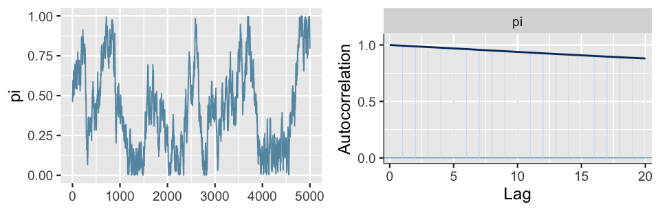

# Diagnostica delle catene markoviane {#diagn-markov-chains}

```{r setup, include = FALSE}
source("_common.R")
source("_stan_options.R")
suppressPackageStartupMessages(library("rethinking")) 
suppressPackageStartupMessages(library("brms")) 
```

Come discusso nel Paragrafo \@ref(cmdstanr-gautret), le catene di Markov forniscono un'approssimazione che tende a convergere alla distribuzione a posteriori. "Approssimazione" e "convergenza" sono le parole chiave qui: il punto è che il campionamento MCMC non è perfetto. Questo solleva le seguenti domande:

- A cosa corrisponde, dal punto di vista grafico, una "buona" catena di Markov?

- Come possiamo sapere se il campione prodotto dalla catena di Markov costituisce un'approssimazione adeguata della distribuzione a posteriori?

- Quanto deve essere grande la dimensione del campione casuale prodotto dalla  catena Markov?

Rispondere a queste ed altre domande di questo tipo fa parte di quell'insieme di pratiche che vano sotto il nome di _diagnostica delle catene Markoviane_. 

La diagnostica delle catene Markoviane non è "una scienza esatta". Ovvero, non sono disponibili procedure valide in tutti i casi e non sempre siamo in grado di rispondere alle domande precedenti. È piuttosto l'esperienza del ricercatore che consente di riconoscere una "buona" catena di Markov e a suggerire cosa si può fare per riparare una "cattiva" catena di Markov. In questo Capitolo ci concentreremo su alcuni strumenti diagnostici grafici e numerici che possono essere utilizzati per la diagnostica delle catene markoviane. L'utilizzo di questi strumenti diagnostici deve essere eseguito in modo olistico. Nessuna singola diagnostica visiva o numerica è infatti sufficiente: un quadro completo della qualità della catena di Markov si può solo ottenere considerando tutti gli strumenti descritti di seguito.

## Esame dei _trace plot_

La convergenza e il "mixing" possono essere controllate mediante il _trace plot_ che mostra l'andamento delle simulazioni e ci dice se stiamo effettivamente utilizzando una distribuzione limite. Consideriamo nuovamente il _trace plot_ del simulazione Beta-Binomiale della figura \@ref(fig:trace-plot-gautret-2):

```{r, echo=FALSE, message=FALSE, comment=FALSE, error=FALSE, results=FALSE}
data1_list <- list(
  N = 16,
  y = c(rep(1, 14), rep(0, 2))
)

modelString = "
data {
  int<lower=0> N;
  int<lower=0, upper=1> y[N];
}
parameters {
  real<lower=0, upper=1> theta;
}
model {
  theta ~ beta(2, 2);
  y ~ bernoulli(theta);
}
generated quantities {
  int y_rep[N];
  real log_lik[N];
  for (n in 1:N) {
    y_rep[n] = bernoulli_rng(theta);
    log_lik[n] = bernoulli_lpmf(y[n] | theta);
  }
}
"
writeLines(modelString, con = "code/oneprop1.stan")

file <- file.path("code", "oneprop1.stan")
mod <- cmdstan_model(file)

fit1 <- mod$sample(
  data = data1_list,
  iter_sampling = 4000L,
  iter_warmup = 2000L,
  seed = SEED,
  chains = 4L,
  parallel_chains = 4L,
  refresh = 0,
  thin = 1
)

stanfit1 <- rstan::read_stan_csv(fit1$output_files())
posterior1 <- extract(stanfit1)
```

```{r trace-plot-gautret-2,  echo=FALSE, fig.cap="Trace plot per il modello Beta-Binomiale dei dati di Gautret et al.(2020)."}
stanfit1 %>% 
  mcmc_trace(pars = c("theta"), size = 0.1)
```

La figura \@ref(fig:trace-plot-gautret-2) fornisce un esempio perfetto di come dovrebbero apparire i _trace plot_. Quando le catene markoviane raggiungono uno stato stazionario e sono stabili ciò significa che hanno raggiunto la distribuzione stazionaria e il _trace plot_ rivela una assenza di struttura e assomiglia alla rappresentazione del rumore bianco, come nella figura \@ref(fig:trace-plot-gautret-2).
Al contrario, la figura \@ref(fig:bad-trace-bayesrules) indica mancanza di convergenza^[Figura riprodotta da @Johnson2022bayesrules].

```{r bad-trace-bayesrules, echo=FALSE, fig.cap="Trace plots (a sinistra) e corrispondenti grafici di densità (a destra) di due ipotetiche catene di Markov. Queste figure forniscono due esempi di come potrebbero apparire delle catene di Markov non stazionarie. Le linee nere sovrapposte alle densità empiriche (a destra) rappresentano una ipotetica distribuzione target Beta(11,3)."}
knitr::include_graphics("images/bad-trace-bayesrules.png")
```

Consideriamo i trace-plot della figura \@ref(fig:bad-trace-bayesrules) (a sinistra). La tendenza verso il basso indica che la catena A non è stazionaria, ovvero non si mantiene costante all'evolversi nel tempo. La tendenza verso il basso suggerisce inoltre la presenza di una forte correlazione tra i valori della catena: il trace-plot non fornisce una rappresentazione di rumore indipendente. Tutto questo significa che la catena A "si sta mescolando lentamente". Sebbene le catene di Markov siano intrinsecamente dipendenti, più si comportano come se fossero dei campioni casuali (rumorosi), minore è l'errore dell'approssimazione alla distribuzione a posteriori. La catena B presenta un problema diverso. Come evidenziato dalle due linee completamente piatte nel tracciato, essa tende a bloccarsi quando visita valori bassi di $\theta$. 

Gli istogrammi lisciati della figura \@ref(fig:bad-trace-bayesrules) (a destra) confermano che entrambe queste catene sono problematiche: infatti producono approssimazioni scadenti della distribuzione a  posteriori che, nell'esempio di @Johnson2022bayesrules, è una $\mbox{Beta}(11, 3)$ (curva nera nella figura). Consideriamo la catena A. Dal momento che si sta mescolando lentamente, nelle iterazioni eseguite ha esplorato unicamente i valori $\theta$ nell'intervallo da 0.6 a 0.9. Di conseguenza, la sua approssimazione della distribuzione a posteriori sopravvaluta la plausibilità dei valori $\theta$ in questo intervallo e, nel contempo, sottovaluta la plausibilità dei valori $\theta$ esterni a questo intervallo. Consideriamo ora la catena B. Rimanendo bloccata, la catena B campiona in maniera eccessiva alcuni valori nella coda sinistra della distribuzione a posteriori di $\theta$. Questo fenomeno produce i  picchi che sono presenti nell'approssimazione alla distribuzione a posteriori.

In pratica, al di là dei presenti esempi "scolastici" (in cui disponiamo di una formulazione analitica della distribuzione a posteriori), non abbiamo mai il privilegio di poter confrontare i risultati del campionamento MCMC con la corretta distribuzione a posteriori. Ecco perché la diagnostica delle catene di Markov è così importante: se vediamo trace-plots come quelli della figura \@ref(fig:bad-trace-bayesrules), sappiamo che non abbiamo ottenuto una adeguata approssimazione della distribuzione a posteriori.

In tali circostanze possiamo ricorrere ad alcuni rimedi.

1. Controllare il modello. Siamo sicuri che le distribuzioni a priori e la verosimiglianza siano appropriate per i dati osservati?

2. Utilizzare un numero maggiore di iterazioni. Alcune tendenze indesiderate a breve termine della catena possono appianarsi nel lungo termine.


## Confronto delle catene parallele

Nella simulazione `cmdstanr()` per il modello Beta-Binomiale dei dati di @Gautret_2020 abbiamo utilizzato quattro catene di Markov parallele. Non solo è necessario che ogni singola catena sia stazionaria (come discusso sopra), ma è anche necessario che le quattro catene siano coerenti tra loro. Sebbene le catene  esplorino percorsi diversi nello spazio dei parametri, quando  convergono ad uno stato di equilibrio dovrebbero presentare caratteristiche simili e dovrebbero produrre approssimazioni simili alla distribuzione a posteriori. Per l'esempio del modello Beta-Binomiale dei dati di @Gautret_2020, i seguenti istogrammi lisciati indicano che le quattro catene producono approssimazioni quasi indistinguibili della distribuzione a posteriori. Ciò prova che la  simulazione è stabile e contiene un nunero sufficiente di valori: l'esecuzione delle catene per un numero maggiore di iterazioni non migliorerebbe l'approssimazione della distribuzione a posteriori. 

```{r}
mcmc_dens_overlay(stanfit1, pars = "theta") + 
  ylab("density")
```

Per fare un confronto, consideriamo la simulazione di una catena di Markov più corta per lo stesso modello. La chiamata seguente richiede  quattro catene parallele per sole 100 iterazioni ciascuna:

```{r, message=FALSE, comment=FALSE, error=FALSE}
bb_short <- mod$sample(
  data = data1_list,
  iter_sampling = 50*2L,
  seed = SEED,
  chains = 4L,
  parallel_chains = 4L,
  refresh = 0,
  thin = 1
)

stanfit_bb_short <- rstan::read_stan_csv(bb_short$output_files())
```

\noindent
Di seguito sono riportati i _trace-plot_ e i corrispondenti istogrammi lisciati. 

```{r}
mcmc_trace(stanfit_bb_short, pars = "theta")
```

```{r}
mcmc_dens_overlay(stanfit_bb_short, pars = "theta")
```

Anche se i _trace plot_ sembrano tutti mostrare un andamento casuale, gli istogrammi lisciati sono piuttosto diversi tra loro e producono approssimazioni diverse della distribuzione a posteriori. Di fronte a tale instabilità è chiaro che sarebbe un errore interrompere la simulazione dopo solo 100 iterazioni.


## Numerosità campionaria effettiva

Nella simulazione del modello Beta-Binomiale per i dati di @Gautret_2020 abbiamo utilizzato quattro catene di Markov parallele che producono un totale di $N$ = 16000 campioni _dipendenti_ di $\theta$. Sapendo che l'errore dell'approssimazione alla distribuzione a posteriori è probabilmente più grande di quello che si otterrebbe usando 16000 campioni _indipendenti_, ci possiamo porre la seguente domanda: quanti campioni indipendenti sarebbero necessari per produrre un'approssimazione della distribuzione a posteriori equivalentemente a quella che abbiamo ottenuto? La numerosità campionaria effettiva (_effective sample size_, $N_{eff}$) fornisce una risposta a questa domanda. 

Tipicamente, $N_{eff} < N$, per cui il rapporto campionario effettivo (_effective sample size ratio_) $\frac{N_{eff}}{N}$ è minore di 1. Come regola euristica, viene considerato problematico un rapporto campionario effettivo minore del 10% del numero totale di campioni ottenuti nella simulazione (più basso è il rapporto campionario effettivo peggiore è il "mixing" della catena). La funzione `bayesplot::neff_ratio()` consente di calcolare il rapporto campionario effettivo. Per il modello Beta-Binomiale dei dati di @Gautret_2020, questo rapporto è di circa 0.34:

```{r}
bayesplot::neff_ratio(stanfit1, pars = c("theta"))
```

Ciò indica che l'accuratezza dell'approssimazione della distribuzione a posteriori di $\theta$ ottenuta mediante 16000 campioni dipendenti è approssimativamente simile a quella che si potrebbe ottenere con 

```{r}
bayesplot::neff_ratio(stanfit1, pars = c("theta")) * 16000
```
\noindent
campioni _indipendenti_. In questo esempio, il rapporto campionario effettivo è maggiore di 0.1; dunque non ci sono problemi.


## Autocorrelazione

Normalmente un algoritmo MCMC genera catene di Markov di campioni, ognuno dei quali è autocorrelato a quelli generati immediatamente prima e dopo di lui. Conseguentemente campioni successivi non sono indipendenti ma formano una catena di Markov con un certo grado di correlazione. Il valore $\theta^{(i)}$ tende ad essere più simile al valore $\theta^{(i-1)}$ che al valore $\theta^{(i-2)}$, o al valore $\theta^{(i-3)}$, eccetera. Una misura di ciò è fornita dall'autocorrelazione tra i valori consecutivi della catena. 

Il correlogramma per ciascuna delle quattro catene dell'esempio si produce con la seguente chiamata:

```{r}
bayesplot::mcmc_acf(stanfit1, pars = "theta")
```

Il correlogramma mostra l'autocorrelazione in funzione di ritardi da 0 a 20. L'autocorrelazione di lag 0 è naturalmente 1 -- misura la correlazione tra un valore della catena di Markov e se stesso. L'autocorrelazione di lag 1 è di circa 0.5, indicando una correlazione moderata tra i valori della catena che distano di solo 1 passo l'uno dall'altro. Successivamente, l'autocorrelazione diminuisce rapidamente ed è effettivamente pari a 0 per un lag di 5. Questo risultato fornisce una conferma del fatto che la catena di Markov costituisce una buona approssimazione di un campione casuale di $p(\theta \mid y)$.

Al contrario, nella figura \@ref(fig:bad-autocorrelation) (a destra) [riprodotta da @Johnson2022bayesrules] vediamo un esempio nel quale il trace plot rivela una forte tendenza tra i valori di una catena di Markov e, dunque, una forte autocorrelazione. 
```{r, bad-autocorrelation, echo=FALSE, fig.cap="Trace plot (a sinistra) e correlogramma (a destra) di una catena di Markow in cui il mixing è lento -- figura riprodotta da @Johnson2022bayesrules."}

```

Questa osservazione è confermata nell'correlogramma (a destra). La lenta diminuzione della curva di autocorrelazione indica che la dipendenza tra i valori della catena non svanisce rapidamente. Con un lag di 20 la correlazione è addirittura pari a 0.9. Poiché i valori della catena sono fortemente associati tra loro, il "mixing" è lento: la simulazione richiede un numero molto grande di iterazioni per esplorare adeguatamente l'intera gamma di valori della distribuzione a posteriori.^[Una (famiglia di) catene di Markov è _rapidly mixing_ se mostra un comportamento simile a quello di un campione indipendente: i valori delle catene si addensano nell'intervallo dei valori più plausibili della distribuzione a posteriori; l'autocorrelazione tra i valori della catena diminuisce rapidamente; il rapporto campionario effettivo è ragionevolmente grande. Le catene che non sono _rapidly mixing_ non godono delle caratteristiche di un campione indipendente: le catene non si addensano nell'intervallo dei valori più plausibili della distribuzione a posteriori; l'autocorrelazione tra i valori della catena diminuisce molto lentamente; il rapporto campionario effettivo è piccolo.]

In presenza di catene di Markov non _rapidly mixing_ sono possibili due rimedi.

- Aumentare il numero di iterazioni. Anche una catena non _rapidly mixing_ può produrre eventualmente una buona approssimazione della distribuzione a posteriori se il numero di iterazioni è sufficientemente grande.
- _Thinning_. Per esempio, se la catena di Markov è costituita da 16000 valori di $\theta$, potremmo decidere di conservare solo ogni secondo valore e ignorare gli altri valori: $\{\theta^{(2)}, \theta^{(4)}, \theta^{(6)}, \dots, \theta^{(16000)}\}$. Oppure, potremmo decidere di conservare ogni decimo valore: $\{\theta^{(10)}, \theta^{(20)}, \theta^{(30)}, \dots, \theta^{(16000)}\}$. Scartando i campioni intermedi, è possibile rimuovere le forti correlazioni che sono presenti nel caso di lag più piccoli.

Vediamo ora come sia possibile estrarre i valodi di una catena dall'oggetto `stanfit1`.

```{r}
# valori delle 4 catene
S <- ggmcmc::ggs(stanfit1)
head(S)
```

\noindent
La prima catena può essere isolata nel modo seguente:

```{r}
S1 <- S %>% 
  dplyr::filter(
    Chain == 1,
    Parameter == "theta"
  )
```
\noindent
Una serie temporale della catena si ottiene con la funzione `ggmcmc::ggs_running`:

```{r}
ggmcmc::ggs_running(S1)
```

\noindent
Il grafico precedente mostra che, per il modello bayesiano che stiamo discutendo, una condizione di equilibrio della catena di Markov richiederebbe un numero maggiore di iterazioni di quelle che sono state effettivamente simulate.

L'autocorrelazione di ordine 1 si ottiene nel modo seguente (si veda il Paragrafo \@ref(approx-post-autocor)):

```{r}
cor(S1$value[-length(S1$value)], S1$value[-1])
```

\noindent
Questo valore corrisponde a ciò che è riportato nel correlogramma mostrato sopra.


## Statistica $\hat{R}$

In precedenza abbiamo detto che non solo è necessario che ogni singola catena sia stazionaria, è anche necessario che le diverse catene siano coerenti tra loro. La statistica $\hat{R}$ affronta questo problema calcolando il rapporto tra la varianza tra le catene markoviane e la varianza entro le catene. In una situazione ottimale $\hat{R} = 1$; se $\hat{R}$ è lontano da 1 questo vuol dire che non è ancora stata raggiunta la convergenza. 

È possibile calcolare $\hat{R}$ mediante la chiamata alla funzione `bayesplot::rhat()`. Per il modello Beta-Binomiale applicato ai dati di @Gautret_2020 abbiamo:

```{r}
bayesplot::rhat(stanfit1, pars = "theta")
```
\noindent
il che indica che il valore $\hat{R}$ ottenuto è molto simile al valore ottimale. 

In maniera euristica, si può affermare che se $\hat{R}$ supera la soglia di 1.05 questo viene interpretato come evidenza che le diverse catene parallele non producono approssimazioni coerenti della distribuzione a posteriori, quindi la simulazione è instabile.

Una rappresentazione grafica dei valori $\hat{R}$ per tutti i parametri del modello si ottiene con la seguente chiamata:

```{r}
ggmcmc::ggs_Rhat(S) + xlab("R_hat") + xlim(0.95, 1.05)
```


## Diagnostica di convergenza di Geweke

La statistica diagnostica di convergenza di Geweke è basata su un test per l'uguaglianza delle medie della prima e dell'ultima parte di una catena di Markov (di default il primo 10% e l'ultimo 50% della catena). Se i due campioni sono estratti dalla distribuzione stazionaria della catena, le due medie sono statisticamente uguali e la statistica di Geweke ha una distribuzione asintotica Normale standardizzata. 

Utilizzando l'oggetto `stanfit1`, possiamo recuperare la statistica di Geweke nel modo seguente:

```{r}
fit_mcmc <- As.mcmc.list(
  stanfit1,
  pars = c("theta")
)
coda::geweke.diag(fit_mcmc, frac1 = .1, frac2 = .5) 
```
\noindent
Per interpretare questi valori ricordiamo che la statistica di Geweke è uguale a zero quando le medie delle due porzioni della  catena di Markov sono uguali. Valori maggiori di $\mid 2 \mid$ suggeriscono che la catena non ha ancora raggiunto una distribuzione stazionaria.


