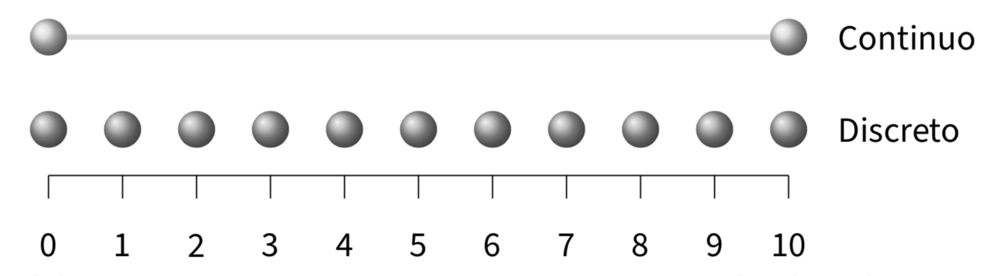

# La misurazione in psicologia {#chapter-misurazione}

Introduco il problema della misurazione in psicologia parlando dell'intelligenza. In quanto psicologi, siamo abituati a pensare alla misurazione dell'intelligenza, ma anche le persone che non sono psicologi sono ben familiari con la misurazione dell'intelligenza: tra le misurazioni delle caratteristiche psicologiche, infatti, la misurazione dell'intelligenza è forse la più conosciuta. 

I test di intelligenza consistono in una serie di problemi di carattere verbale, numerico o simbolico. Come ci si può aspettare, alcune persone riescono a risolvere correttamente un numero maggiore di problemi di altre. Possiamo contare il numero di risposte corrette e osservare le differenze individuali nei punteggi calcolati. Scopriamo in questo modo che le differenze individuali nell'abilità di risolvere tali problemi risultano sorprendentemente stabili nell'età adulta. Inoltre, diversi test di intelligenza tendono ad essere correlati positivamente: le persone che risolvono un maggior numero di problemi verbali, in media, tenderanno anche a risolvere correttamente un numero più grande di numerici e simbolici. Esiste quindi una notevole coerenza delle differenze osservate tra le persone, sia nel tempo sia considerando diverse procedure di test e valutazione. 

Avendo stabilito che ci sono differenze individuali tra le persone, è possibile esaminare le associazioni tra i punteggi dei test di intelligenza e altre variabili. Possiamo indagare se le persone con punteggi più alti nei test di intelligenza, rispetto a persone che ottengono punteggi più bassi, hanno più successo sul lavoro; se guadagnano di più; se votano in modo diverso; o se hanno un'aspettativa di vita più alta. Possiamo esaminare le differenze nei punteggi dei test di intelligenza in funzione di variabili come il genere, il gruppo etnico-razziale o lo stato socio-economico. Possiamo fare ricerche sull'associazione tra i punteggi dei test di intelligenza e l'efficienza dell'elaborazione neuronale, i tempi di reazione o la quantità di materia grigia all'interno della scatola cranica. Tutte queste ricerche sono state condotte e gli psicologi hanno scoperto una vasta gamma di associazioni tra le misure dell'intelligenza e altre variabili. Alcune di queste associazioni sono grandi e stabili, altre sono piccole e difficili da replicare. In riferimento all'intelligenza, dunque, gli psicologi hanno condotto un enorme numero di ricerche ponendosi domande diverse. In quali condizioni si verificano determinati effetti? Quali variabili mediano o moderano le relazioni tra i punteggi dei test di intelligenza e altre variabili? Queste relazioni si mantengono stabili in diversi gruppi di persone? Le ricerche sull'intelligenza umana sono un campo in continuo sviluppo.

Tuttavia, tuttavia una domanda sorge spontanea: i test di intelligenza misurano davvero qualcosa e, in caso affermativo, che cos'è questo qualcosa? Infatti, dopo un secolo di teoria e ricerca sui punteggi dei test di intelligenza e, in generale, sui test psicologici, non sappiamo ancora con precisione cosa effettivamente questi test misurano.
Queste considerazioni relative ai test di intelligenza ci conducono dunque alla domanda che ha motivato le precedenti considerazioni: cosa significa misurare un attributo psicologico? Questa è una domanda a cui è difficile rispondere, una domanda a cui è dedicata un'intera area di ricerca, quella della teoria della misurazione psicologica. 

Non possiamo qui entrare nel merito delle complessità formali della teoria della misurazione psicologica -- questo argomento verrà approfondito nei successivi insegnamenti sulla testistica psicologica. Ci limiteremo invece a presentare alcune nozioni di base su un tema centrale della teoria della misurazione psicologica: il tema  delle scale delle misure psicologiche.

## Le scale di misura

In generale possiamo dire che la teoria della misurazione si occupa dello studio delle relazioni esistenti tra due domini: il "mondo fisico" e il "mondo psicologico". Secondo la teoria della misurazione, la misurazione è un'attività rappresentativa, cioè è un processo di assegnazione di numeri in modo tale da preservare, all'interno del dominio numerico, le relazioni qualitative che sono state osservate nel mondo empirico. La teoria della misurazione ha lo scopo di specificare le condizioni necessarie per la costruzione di una rappresentazione adeguata delle relazioni empiriche all'interno di un sistema numerico. Da una prospettiva formale, le operazioni descritte dalla teoria della misurazione possono essere concettualizzate in termini di mappatura tra le relazioni esistenti all'interno di due insiemi (quello empirico e quello numerico). Il risultato di questa attività è chiamato "scala di misurazione". 

Una famosa teoria delle scale di misura è stata proposta da @stevens46. Stevens ci fa notare che, in linea di principio, le variabili psicologiche sono in grado di rappresentare (preservare) con diversi gradi di accuratezza le relazioni qualitative che sono state osservate nei fenomeni psicologici. Secondo la teoria di Stevens, possiamo distinguere tra quattro scale di misura: le scale nominali (*nominal scales*), ordinali (*ordinal scales*), a intervalli (*interval scales*), di rapporti (*ratio scales*). Tali scale di misura consentono operazioni aritmetiche diverse, come indicato nella tabella successiva, in quanto ciasuna di esse è in grado di "catturare" soltanto alcune delle proprietà dei fenomeni psicologici che intende misurare.

{width=80%}

### Scala nominale

Il livello di misurazione più semplice è quello della scala nominale. Questa scala di misurazione corrisponde ad una tassonomia. I simoboli o numeri che costituiscono questa scala non sono altro che i nomi delle categorie che utilizziamo per classificare i fenomeni psicologici. In base alle misure fornite da una scala nominale, l'unica cosa che siamo in grado di dire a proposito di una caratteristica psicologica è se essa è uguale o no ad un'altra caratteristica psicologica.

La scala nominale raggruppa dunque i dati in categorie qualitative *mutuamente esclusive* (cioè nessun dato si può collocare in più di una categoria).
Esiste la sola relazione di equivalenza tra le misure delle u.s., cioè
nella scala nominale gli elementi del campione appartenenti a classi
diverse sono differenti, mentre tutti quelli della stessa classe sono
tra loro equivalenti: $x_i = x_j$ oppure $x_i \neq x_j$. 

L'unica operazione algebrica che possiamo compiere sulle modalità della scala nominale è quella di contare le u.s. che appartengono ad ogni modalità e contare il numero delle modalità (classi di equivalenza). Dunque la descrizione dei dati avviene tramite le frequenze assolute e le frequenze relative.

A partire da una scala nominale è possibile costruire altre scale nominali che sono equivalenti alla prima trasformando i valori della scala di partenza in modo tale
da cambiare i nomi delle modalità, ma lasciando però inalterata la suddivisione u.s. nelle medesime classi di equivalenza. Questo significa che prendendo una variabile misurata su scala nominale e cambiando i nomi delle sue categorie otteniamo una nuova variabile esattamente corrispondente alla prima.

### Scala ordinale

La scala ordinale conserva la proprietà della scala nominale di classificare ciascuna u.s. all'interno di una e una sola categoria, ma alla relazione di equivalenza tra elementi di una stessa classe aggiunge la relazione di ordinamento tra le classi di equivalenza. Essendo basata su una relazione d'ordine, una scala ordinale descrive soltanto l'ordine di rango tra le modalità, ma non ci dà alcuna informazione su quanto una modalità sia più grande di un'altra. Non ci dice, per esempio, se la distanza tra le modalità $a$ e $b$ sia uguale, maggiore o minore della distanza tra le modalità $b$ e $c$.

::: {.example}
Un esempio classico di scala ordinale è quello della scala Mohs per la
determinazione della durezza dei minerali. Per stabilire la durezza dei
minerali si usa il criterio empirico della scalfittura. Vengono
stabiliti livelli di durezza crescente da 1 a 10 con riferimento a dieci
minerali: talco, gesso, calcite, fluorite, apatite, ortoclasio, quarzo,
topazio, corindone e diamante. Un minerale appartenente ad uno di questi
livelli se scalfisce quello di livello inferiore ed è scalfito da quello
di livello superiore.
::: 

### Scala ad intervalli

La scala ad intervalli include le proprietà di quella nominale e di
quella ordinale, e in più consente di misurare le distanze tra le coppie
di u.s. nei termini di un intervallo costante, chiamato *unità di
misura*, a cui viene attribuito il valore "1". La posizione dell'origine
della scala, cioè il punto zero, è scelta arbitrariamente, nel senso che
non indica l'assenza della quantità che si sta misurando. Avendo uno
zero arbitrario, questa scala di misura consente valori negativi. Lo
zero, infatti, *non* viene attribuito all'u.s. in cui la proprietà
misurata risulta assente.

La scala a intervalli equivalenti ci consente di effettuare operazioni
algebriche basate sulla differenza tra i numeri associati ai diversi
punti della scala, operazioni algebriche non era possibile eseguire nel
caso di misure a livello di scala ordinale o nominale. Il limite della
scala ad intervalli è quello di non consentire il calcolo del rapporto
tra coppie di misure. Possiamo dire, per esempio, che la distanza tra
$a$ e $b$ è la metà della distanza tra $c$ e $d$. Oppure che la distanza
tra $a$ e $b$ è uguale alla distanza tra $c$ e $d$. Non possiamo dire,
però, che $a$ possiede la proprietà misurata in quantità doppia rispetto
$b$. Non possiamo cioè stabilire dei rapporti diretti tra le misure
ottenute. Solo per le *differenze* tra le modalità sono dunque permesse
tutte le operazioni aritmetiche: le differenze possono essere tra loro
sommate, elevate a potenza oppure divise, determinando così le quantità
che stanno alla base della statistica inferenziale.

Nelle scale ad intervalli equivalenti, l'unità di misura è arbitraria,
ovvero può essere cambiata attraverso una dilatazione, operazione che
consiste nel moltiplicare tutti i valori della scala per una costante
positiva. Poiché l'aggiunta di una costante non altera le differenze tra
i valori della scala, è anche ammessa la traslazione, operazione che
consiste nel sommare una costante a tutti i valori della scala. Essendo
la scala invariate rispetto alla traslazione e alla dilatazione, le
trasformazioni ammissibili sono le *trasformazioni lineari*:
$$y' = a + by, \quad b > 0.$$
L'aspetto che rimane invariante a seguito di una trasformazione lineare
è l'uguaglianza dei rapporti fra intervalli.

::: {.example}
Esempio di scala ad intervalli è la temperatura misurata in gradi
Celsius o Fahrenheit, ma non Kelvin. Come per la scala nominale, è
possibile stabilire se due modalità sono uguali o diverse: 30$^\circ$C
$\neq$ 20$^\circ$C. Come per la scala ordinale è possibile mettere due
modalità in una relazione d'ordine: 30$^\circ$C $>$ 20$^\circ$C. In
aggiunta ai casi precedenti, però, è possibile definire una unità di
misura per cui è possibile dire che tra 30$^\circ$C e 20$^\circ$C c'è
una differenza di 30$^\circ$ - 20$^\circ$ = 10$^\circ$C. I valori di
temperatura, oltre a poter essere ordinati secondo l'intensità del
fenomeno, godono della proprietà che le differenze tra loro sono
direttamente confrontabili e quantificabili.

Il limite della scala ad intervalli è quello di non consentire il
calcolo del rapporto tra coppie di misure. Ad esempio, una temperatura
di 80$^\circ$C non è il doppio di una di 40$^\circ$C. Se infatti
esprimiamo le stesse temperature nei termini della scala Fahrenheit,
allora i due valori non saranno in rapporto di 1 a 2 tra loro. Infatti,
20$^\circ$C = 68$^\circ$F e 40$^\circ$C = 104$^\circ$F. Questo significa
che la relazione "il doppio di" che avevamo individuato in precedenza si
applicava ai numeri della scala centigrada, ma non alla proprietà
misurata (cioè la temperatura). La decisione di che scala usare
(Centigrada vs. Fahrenheit) è arbitraria. Ma questa arbitrarietà non
deve influenzare le inferenze che traiamo dai dati. Queste inferenze,
infatti, devono dirci qualcosa a proposito della realtà empirica e non
possono in nessun modo essere condizionate dalle nostre scelte
arbitrarie che ci portano a scegliere la scala Centigrada piuttosto che
quella Fahrenheit.

Consideriamo ora l'aspetto invariante di una trasformazione lineare, ovvero l'uguaglianza dei rapporti fra intervalli. Prendiamo in esame, ad esempio, tre temperature:
$20^\circ C = 68^\circ F$,
$15^\circ C = 59^\circ F$,
$10^\circ C = 50 ^\circ F$.

È facile rendersi conto del fatto che i rapporti fra intervalli restano costanti indipendentemente dall'unità di misura che è stata scelta:
$$
  \frac{20^\circ C - 10^\circ C}{20^\circ C - 15^\circ C} =
  \frac{68^\circ F - 50^\circ F}{68^\circ F-59^\circ F} = 2.
$$
::: 

### Scala di rapporti

Nella scala a rapporti equivalenti la posizione dello zero non è
arbitraria, ma corrisponde all'elemento dotato di intensità nulla
rispetto alla proprietà misurata. Una scala a rapporti equivalenti si
costruisce associando il numero 0 all'elemento con intensità nulla;
viene poi scelta un'unità di misura $u$ e, ad ogni elemento, si assegna
un numero $a$ definito come: $$a = \frac{d}{u}$$ dove $d$ rappresenta la
distanza dall'origine. Alle u.s. vengono dunque assegnati dei numeri
tali per cui le differenze e i rapporti tra i numeri riflettono le
differenze e i rapporti tra le intensità della proprietà misurata.

Operazioni aritmetiche sono possibili non solo sulle differenze tra i
valori della scala (come per la scala a intervalli equivalenti), ma
anche sui valori stessi della scala. L'unica arbitrarietà riguarda
l'unità di misura che si utilizza. L'unità di misura può cambiare, ma
qualsiasi unità di misura si scelga, lo zero deve sempre indicare
l'intensità nulla della proprietà considerata.

Le trasformazioni ammissibili a questo livello di scala sono dette
trasformazioni di similarità: $$y' = by, \quad b > 0.$$ A questo livello
di scala, a seguito delle trasformazioni ammissibili, rimangono
invariati anche i rapporti: $$\frac{y_i}{y_j} = \frac{y'_i}{y'_j}.$$

## Gerarchia dei livelli di scala di misura

@stevens46 parla di *livelli di scala* poiché i quattro tipi di scala di
misura stanno in una precisa gerarchia: la scala nominale rappresenta il
livello più basso della misurazione, la scala a rapporti equivalenti è
invece il livello più alto.

| Scale di modalità |  Operazioni aritmetiche |
| ----------------- | ------------------------------------------------- |
| nominali          | enumerare le classi di equivalenza e/o            |
|                   | le frequenze per ciascuna classe di equivalenza   |
| ordinali          | enumerare le classi di equivalenza e/o            |
|                   | le frequenze per ciascuna classe di equivalenza   |
| intervallari      | differenze (rapporti tra differenze)              |
| di rapporti       | rapporti diretti tra le misure                    |

Passando da un livello di misurazione ad uno più alto aumenta il numero di operazioni aritmetiche che possono essere compiute sui valori della scala, come indicato nella figura seguente.

{width=80%} 

Per ciò che riguarda le trasformazioni ammissibili, più il livello di
scala è basso, più le funzioni sono generali (sono minori cioè i vincoli
per passare da una rappresentazione numerica ad un'altra equivalente).
Salendo la gerarchia, la natura delle funzioni di trasformazione si fa
più restrittiva.

## Variabili discrete o continue

Le variabili a livello di intervalli e di rapporti possono essere
discrete o continue. Le variabili discrete possono assumere alcuni
valori ma non altri. Una volta che l'elenco di valori accettabili è
stato specificato, non ci sono casi che cadono tra questi valori.
Le variabili discrete di solito assumono valori interi.

Quando una variabile può assumere qualsiasi valore entro un intervallo
specificato, allora si dice che la variabile è continua. In teoria, ciò
significa che frazioni e decimali possono essere utilizzati per
raggiungere un livello di precisione qualsiasi. In pratica, a un certo
punto dobbiamo arrotondare i numeri, rendendo tecnicamente la variabile
discreta. In variabili veramente discrete, tuttavia, non è possibile
aumentare a piacimento il livello di precisione della misurazione.

{width=80%} 

::: {.example}
Il numero di biciclette possedute da una persona è una variabile discreta poiché tale variabile può assumere come modalità solo i numeri interi non negativi. Frazioni di bicicletta non hanno senso.
:::

## Alcune misure sono migliori di altre

In psicologia, ciò che vogliamo misurare non è una caratteristica fisica, ma invece è un concetto teorico inosservabile, ovvero un costrutto.

> Un costrutto rappresenta il risultato di una fondata riflessione scientifica, non è per definizione accessibile all'osservazione diretta, ma viene inferito dall'osservazione di opportuni indicatori (Sartori, 2005).

Ad esempio, supponiamo che un docente voglia valutare quanto bene uno studente comprenda la distinzione tra le quattro diverse scale di misura che sono state descritte sopra. Il docente potrebbe predisporre un test costituito da un insieme di domande e potrebbe
contare a quante domande lo studente risponde correttamente. Questo
test, però, può o può non essere una buona misura del costrutto relativo
alla conoscenza effettiva delle quattro scale di misura. Per esempio, se
il docente scrive le domande del test in modo ambiguo o se usa una
linguaggio troppo tecnico che lo studente non conosce, allora i
risultati del test potrebbero suggerire che lo studente non conosce la
materia in questione anche se in realtà questo non è vero. D'altra
parte, se il docente prepara un test a scelta multipla con risposte
errate molto ovvie, allora lo studente può ottenere dei buoni risultati
al test anche senza essere in grado di comprendere adeguatamente le
proprietà delle quattro scale di misura.

In generale non è possibile misurare un costrutto senza una certa
quantità di errore. Poniamoci dunque il problema di determinare in che
modo una misurazione possa dirsi adeguata.

### Tipologie di errori

L'errore è, per definizione, la differenza tra il valore vero e il
valore misurato della grandezza in esame. Gli errori sono classificati
come sistematici (o determinati) e casuali (o indeterminati). Gli errori
casuali sono fluttuazioni, in eccesso o in difetto rispetto al valore
reale, delle singole determinazioni e sono dovuti alle molte variabili
incontrollabili che influenzano ogni misura psicologica. Gli errori
sistematici, invece, influiscono sulla misurazione sempre nello stesso
senso e, solitamente, per una stessa quantità (possono essere additivi o
proporzionali).

Le differenze tra le due tipologie di errori, sistematici e casuali,
introducono i concetti di accuratezza e di precisione della misura. Una
misura viene definita:

*   __accurata__, quando vi è un accordo tra la misura effettuata ed il
    valore reale;
*   __precisa__ quando, ripetendo più volte la misura, i risultati
    ottenuti sono concordanti, cioè differiscono in maniera irrilevante
    tra loro.

La metafora del tiro a bersaglio illustra la relazione tra precisione e accuratezza.

(\#fig:fig-tiro-bersaglio)Metafora del tiro al bersaglio.

Per tenere sotto controllo l'incidenza degli errori, sono stati
introdotti in psicologia i concetti di attendibilità e validità.

Uno strumento si dice __attendibile__ quando valuta in modo coerente e
stabile la stessa variabile: i risultati ottenuti si mantengono costanti
dopo ripetute somministrazione ed in assenza di variazioni psicologiche
e fisiche dei soggetti sottoposti al test o cambiamenti dell'ambiente in
cui ha luogo la somministrazione.

L'attendibilità di uno strumento, però, non è sufficiente: in primo luogo uno
strumento di misura deve essere __valido__, laddove la validità rappresenta
il grado in cui uno strumento misura effettivamente ciò che dovrebbe
misurare. In genere, si fa riferimento ad almeno quattro tipi di
validità.

*   La __validità di costrutto__ riguarda il grado in cui un test misura
    ciò per cui è stato costruito. Essa si suddivide in: validità
    convergente e validità divergente. La validità convergente fa
    riferimento alla concordanza tra uno strumento e un altro che misura
    lo stesso costrutto. La validità divergente, al contrario, valuta il
    grado di discriminazione tra strumenti che misurano costrutti
    differenti. Senza validità di costrutto le altre forme di validità
    non hanno senso.
*   In base alla __validità di contenuto__, un test fornisce una misura
    valida di un attributo psicologico se il dominio dell'attributo è
rappresentato in maniera adeguata dagli item del test. Un requisito
di base della validità di contenuto è la rilevanza e la
rappresentatività del contenuto degli item in riferimento
all'attributo che il test intende misurare.
*   La __validità di criterio__ valuta il grado di concordanza tra i
    risultati dello strumento considerato e i risultati ottenuti da
    altri strumenti che misurano lo stesso costrutto, o tra i risultati
    dello strumento considerato e un criterio esterno. Nella validità
    concorrente, costrutto e criterio vengono misurati contestualmente,
    consentendo un confronto immediato. Nella validità predittiva, il
    costrutto viene misurato prima e il criterio in un momento
    successivo, consentendo la valutazione della capacità dello
    strumento di predire un evento futuro.
*   Infine, la __validità di facciata__ fa riferimento al grado in cui il
    test appare valido ai soggetti a cui esso è diretto. La validità di
    facciata è importante in ambiti particolari, quali ad esempio la
    selezione del personale per una determinata occupazione. In questo
    caso è ovviamente importante che chi si sottopone al test ritenga
    che il test vada a misurare quegli aspetti che sono importanti per
    le mansioni lavorative che dovranno essere svolte, piuttosto che
    altre cose. In generale, la validità di facciata non è utile, tranne
    in casi particolari.

## Conclusioni {-}

Una domanda che uno psicologo spesso si pone è: "sulla base delle
evidenze osservate, possiamo concludere dicendo che l'intervento
psicologico è efficace nel trattamento e nella cura del disturbo?" Le
considerazioni svolte in questo capitolo dovrebbero farci capire che,
prima di cercare di rispondere a questa domanda con l'analisi statistica
dei dati, devono essere affrontati i problemi della validità e
dell'attendibilità delle misure (oltre a stabilire l'appropriato livello
di scala di misura delle osservazioni). L'attendibilità è un
prerequisito della validità. Se gli errori di misurazione sono troppo
grandi, i dati sono inutili. Inoltre, uno strumento di misurazione può
essere preciso ma non valido. La validità e l'attendibilità delle
misurazioni sono dunque entrambe necessarie.

In generale, l'attendibilità e la validità delle misure devono essere
valutate per capire se i dati raccolti da un ricercatore siano adeguati
(1) per fornire una risposta alla domanda della ricerca, e (2) per
giungere alla conclusione proposta dal ricercatore alla luce dei
risultati dell'analisi statistica che è stata eseguita. È chiaro che le
informazioni fornite in questo capitolo si limitano a scalfire la
superficie di questi problemi. I concetti qui introdotti, però, devono
sempre essere tenuti a mente e costituiscono il fondamento di quanto
verrà esposto nei capitoli successivi.

