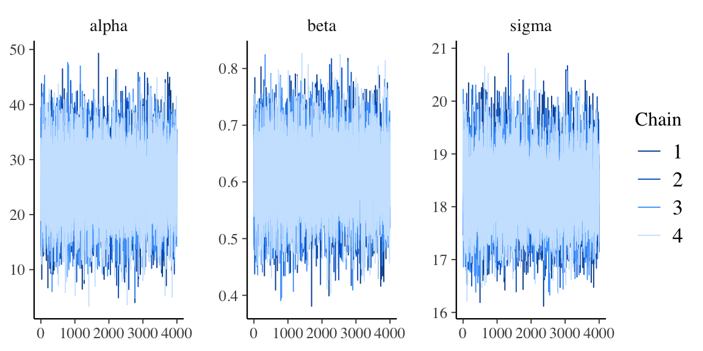
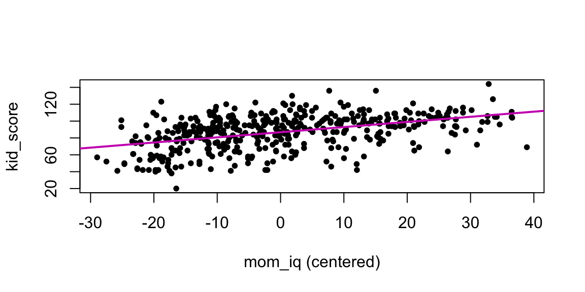
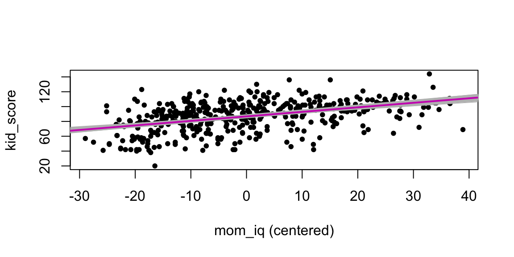

# Regressione lineare con Stan


Obiettivo di questo Capitolo è illustrare come può essere svolta in pratica l'analisi di regressione lineare bayesiana usando il linguaggio Stan. Per fare un esempio concreto useremo un famoso dataset chiamaro `kidiq` [@gelman2020regression] che riporta i dati di un'indagine del 2007 su un campione di donne americane adulte e sui loro bambini di età compres tra i 3 e i 4 anni. I dati sono costituiti da 434 osservazioni e 4 variabili:

- `kid_score`: QI del bambino; è il punteggio totale del _Peabody Individual Achievement Test_ (PIAT) costituito dalla somma dei punteggi di tre sottoscale (Mathematics, Reading comprehension, Reading recognition);
- `mom_hs`: variabile dicotomica (0 or 1) che indica se la madre del bambino ha completato le scuole superiori (1) oppure no (0);
- `mom_iq`: QI della madre;
- `mom_age`: età della madre.

Leggiamo i dati con le seguenti istruzioni R:


```r
library("foreign")
df <- read.dta(here("data", "kidiq.dta"))
head(df)
#>   kid_score mom_hs    mom_iq mom_work mom_age
#> 1        65      1 121.11753        4      27
#> 2        98      1  89.36188        4      25
#> 3        85      1 115.44316        4      27
#> 4        83      1  99.44964        3      25
#> 5       115      1  92.74571        4      27
#> 6        98      0 107.90184        1      18
```

Calcoliamo alcune statistiche descrittive usando la funzione `skimr::skim()`:


```r
df %>% 
  skimr::skim() %>%
  skimr::yank("numeric")
```


**Variable type: numeric**

|skim_variable | n_missing| complete_rate|   mean|    sd|    p0|   p25|   p50|    p75|   p100|hist  |
|:-------------|---------:|-------------:|------:|-----:|-----:|-----:|-----:|------:|------:|:-----|
|kid_score     |         0|             1|  86.80| 20.41| 20.00| 74.00| 90.00| 102.00| 144.00|▁▃▇▇▁ |
|mom_hs        |         0|             1|   0.79|  0.41|  0.00|  1.00|  1.00|   1.00|   1.00|▂▁▁▁▇ |
|mom_iq        |         0|             1| 100.00| 15.00| 71.04| 88.66| 97.92| 110.27| 138.89|▃▇▆▃▂ |
|mom_work      |         0|             1|   2.90|  1.18|  1.00|  2.00|  3.00|   4.00|   4.00|▃▃▁▂▇ |
|mom_age       |         0|             1|  22.79|  2.70| 17.00| 21.00| 23.00|  25.00|  29.00|▂▅▇▃▂ |

Dall'output di `skim()` vediamo che il QI medio dei bambini è di circa 87 mentre quello della madre è di 100. La gamma di età delle madri va da 17 a 29 anni con una media di circa 23 anni. Si noti infine che il 79% delle mamme ha un diploma di scuola superiore.

Ci poniamo il problema di descrivere l'associazione tra il QI dei figli e il QI delle madri mediante un modello di regressione lineare. 

Per farci un'idea del valore dei parametri, iniziamo ad adattare il modello di regressione usando la procedura di massima verosimiglianza:


```r
summary(lm(kid_score ~ mom_iq, data = df))
#> 
#> Call:
#> lm(formula = kid_score ~ mom_iq, data = df)
#> 
#> Residuals:
#>     Min      1Q  Median      3Q     Max 
#> -56.753 -12.074   2.217  11.710  47.691 
#> 
#> Coefficients:
#>             Estimate Std. Error t value Pr(>|t|)    
#> (Intercept) 25.79978    5.91741    4.36 1.63e-05 ***
#> mom_iq       0.60997    0.05852   10.42  < 2e-16 ***
#> ---
#> Signif. codes:  
#> 0 '***' 0.001 '**' 0.01 '*' 0.05 '.' 0.1 ' ' 1
#> 
#> Residual standard error: 18.27 on 432 degrees of freedom
#> Multiple R-squared:  0.201,	Adjusted R-squared:  0.1991 
#> F-statistic: 108.6 on 1 and 432 DF,  p-value: < 2.2e-16
```

Il modello statistico diventa:

$$
\begin{aligned}
y_i &\sim \mathcal{N}(\mu_i, \sigma) \\
\mu_i &= \alpha + \beta x_i \\
\alpha &\sim \mathcal{N}(25, 10) \\
\beta &\sim \mathcal{N}(0, 1) \\
\sigma &\sim \text{Cauchy}(18, 5) 
\end{aligned}
$$
dove la prima riga definisce la funzione di verosimiglianza e righe successive definiscono le distribuzioni a priori dei parametri. Il segno $\sim$ (tilde) si può leggere "si distribuisce come". La prima riga, dunque, ci dice che ciascuna osservazione $y_i$ è una variabile casuale che segue la distribuzione Normale di parametri $\mu_i$ e $\sigma$. La seconda riga specifica, in maniera deterministica, che ciascun $\mu_i$ è una funzione lineare di $x_i$, con parametri $\alpha$ e $\beta$. Le due righe successive specificano le distribuzioni a priori per $\alpha$ e $\beta$. Per $\alpha$, la distribuzione a priori è una distribuzione Normale di parametri $\mu_{\alpha} = 25$ e deviazione standard $\sigma_{\alpha} = 10$. Per  $\beta$, la distribuzione a priori è una distribuzione Normale standardizzata. L'ultima riga definisce la la distribuzione a priori di $\sigma$, ovvero una Cauchy di parametri 18 e 5.

Il modello bayesiano descritto sopra può essere specificato usando il  linguaggio Stan^[Nella discussione che segue ripeto pari pari ciò che è riportato nel manuale del linguaggio [Stan](https://mc-stan.org/docs/2_27/stan-users-guide/standardizing-predictors-and-outputs.html).]. Il codice Stan viene eseguito più velocemente se l'input è standardizzato così da avere una media pari a zero e una varianza unitaria. Poniamoci dunque il problema di eseguire il campionamento MCMC sulle variabili standardizzate per poi riconvertire i parametri trovati sulla stessa scala di misura dei punteggi grezzi.

Ponendo $y = (y_1, \dots, y_n)$ e $x = (x_1, \dots, x_n)$, il modello di regressione può essere scritto come 

$$
y_i = \alpha + \beta x_i + \varepsilon_i,
$$
\noindent
dove 
$$
\varepsilon_i \sim \mathcal{N}(0, \sigma).
$$

\noindent
Se uno dei due vettori $x$ o $y$ ha valori molto grandi o molto piccoli o se la media campionaria dei valori è lontana da 0, allora può essere più efficiente standardizzare la variabile risposta $y$ e i predittori $x$. I dati vengono prima centrati sottraendo la media campionaria, quindi scalati dividendo per la deviazione standard campionaria. Quindi un'osservazione $u$ viene standardizzata dalla funzione $z$ definita da

$$
z_y(u) = \frac{u - \bar{y}}{\texttt{sd}(y)}
$$
\noindent
dove la media $\bar{y}$ è

$$
\bar{y} = \frac{1}{n} \sum_{i=1}^n y_i,
$$
\noindent
e la deviazione standard è

$$
\texttt{sd} = \left(\frac{1}{n}\sum_{i=1}^n(y_i - \bar{y})^2\right)^{-\frac{1}{2}}.
$$

La trasformata inversa è definita invertendo i due passaggi precedenti, ovvero usando la deviazione standard per scalare di nuovo i valori $u$ per poi traslarli con la media campionaria:

$$
z_y^{-1}(u) = \texttt{sd}(y)u + \bar{y}.
$$
Per eseguire la standardizzare all'interno di un'analisi di regressione, i predittori e la variabile risposta vengono standardizzati. Questa trasformazione cambia la scala delle variabili, e quindi cambia anche la scala delle distribuzioni a priori dei parametri. Consideriamo il seguente modello iniziale specificato con la sintassi richiesta dal linguaggio Stan:


```r
modelString = "
data {
  int<lower=0> N;
  vector[N] y;
  vector[N] x;
}
parameters {
  real alpha;
  real beta;
  real<lower=0> sigma;
}
model {
  // priors
  alpha ~ normal(25, 10);
  beta ~ normal(0, 1);
  sigma ~ cauchy(18, 5);
  // likelihood
  for (n in 1:N)
    y[n] ~ normal(alpha + beta * x[n], sigma);
}
"
writeLines(modelString, con = "code/simpleregkidiq.stan")
```

La funzione `modelString()` registra una stringa di testo mentre `writeLines()` crea un file nell'indirizzo specificato. Tale file deve avere l'estensione `.stan`. 

Il blocco _data_ per il modello standardizzato è identico a quello del caso precedente. I predittori e la risposta standardizzati sono definiti nel blocco _transformed data_. Inoltre, per semplificare la notazione (e per velocizzare l'esecuzione), nel blocco _model_ l'istruzione di campionamento è espressa in forma vettorializzata: `y_std ~ normal(alpha_std + beta_std * x_std, sigma_std);`.


```r
modelString = "
data {
  int<lower=0> N;
  vector[N] y;
  vector[N] x;
}
transformed data {
  vector[N] x_std;
  vector[N] y_std;
  x_std = (x - mean(x)) / sd(x);
  y_std = (y - mean(y)) / sd(y);
}
parameters {
  real alpha_std;
  real beta_std;
  real<lower=0> sigma_std;
}
model {
  alpha_std ~ normal(0, 2);
  beta_std ~ normal(0, 2);
  sigma_std ~ cauchy(0, 2);
  y_std ~ normal(alpha_std + beta_std * x_std, sigma_std);
}
generated quantities {
  real alpha;
  real beta;
  real<lower=0> sigma;
  alpha = sd(y) * (alpha_std - beta_std * mean(x) / sd(x))
           + mean(y);
  beta = beta_std * sd(y) / sd(x);
  sigma = sd(y) * sigma_std;
}
"
writeLines(modelString, con = "code/simpleregstd.stan")
```

I parametri vengono rinominati per indicare che non sono i parametri "naturali", ma per il resto il modello è identico. Le distribuzioni a priori per i parametri sono vagamente informative. I parametri originali possono essere recuperati con un po' di algebra. 

\begin{align}
y_n &= \textrm{z}_y^{-1}(\textrm{z}_y(y_n)) \notag\\
    &= \textrm{z}_y^{-1}
\left( \alpha' + \beta' \textrm{z}_x(x_n) + \epsilon_n' \right) \notag\\
    &= \textrm{z}_y^{-1}
\left( \alpha' + \beta' \left( \frac{x_n - \bar{x}}{\texttt{sd}(x)} \right) + \epsilon_n' \right) \notag\\
    &= \texttt{sd}(y)
\left( \alpha' + \beta' \left( \frac{x_n - \bar{x}}{\texttt{sd}(x)} \right) + \epsilon_n' \right) + \bar{y} \notag\\
    &=
\left( \texttt{sd}(y) \left( \alpha' - \beta' \frac{\bar{x}}{\texttt{sd}(x)} \right) + \bar{y} \right)
+ \left( \beta' \frac{\texttt{sd}(y)}{\texttt{sd}(x)} \right) x_n
+ \texttt{sd}(y) \epsilon'_n,
\end{align}

\noindent
da cui

$$
\alpha
=
\texttt{sd}(y)
      \left(
          \alpha'
          - \beta' \frac{\bar{x}}{\texttt{sd}(x)}
      \right)
  + \bar{y};
\qquad
\beta = \beta' \frac{\texttt{sd}(y)}{\texttt{sd}(x)};
\qquad
\sigma = \texttt{sd}(y) \sigma'.
$$
\noindent
I valori dei parametri sulle scale originali possono essere calcolati all'interno di Stan utilizzando il blocco _generated quantities_ che segue il blocco _model_.

\noindent
Sistemiamo i dati nel formato appropriato per Stan:


```r
data_list <- list(
  N = length(df$kid_score),
  y = df$kid_score,
  x = df$mom_iq
)
```

\noindent
La funzione `file.path()` ritorna l'indirizzo del file con il codice Stan:


```r
file <- file.path("code", "simpleregstd.stan")
```

\noindent
Prendendo come input un file contenente un programma Stan, la funzione `cmdstan_model()` ritorna un oggetto di classe `CmdStanModel`. In pratica, `CmdStan` traduce un programma Stan in C++ e crea un eseguibile compilato. 


```r
mod <- cmdstan_model(file)
```

\noindent
Il codice Stan può essere stampato usando il metodo `$print()`:


```r
mod$print()
#> 
#> data {
#>   int<lower=0> N;
#>   vector[N] y;
#>   vector[N] x;
#> }
#> transformed data {
#>   vector[N] x_std;
#>   vector[N] y_std;
#>   x_std = (x - mean(x)) / sd(x);
#>   y_std = (y - mean(y)) / sd(y);
#> }
#> parameters {
#>   real alpha_std;
#>   real beta_std;
#>   real<lower=0> sigma_std;
#> }
#> model {
#>   alpha_std ~ normal(0, 2);
#>   beta_std ~ normal(0, 2);
#>   sigma_std ~ cauchy(0, 2);
#>   y_std ~ normal(alpha_std + beta_std * x_std, sigma_std);
#> }
#> generated quantities {
#>   real alpha;
#>   real beta;
#>   real<lower=0> sigma;
#>   alpha = sd(y) * (alpha_std - beta_std * mean(x) / sd(x))
#>            + mean(y);
#>   beta = beta_std * sd(y) / sd(x);
#>   sigma = sd(y) * sigma_std;
#> }
```

\noindent
L'indirizzo dell'eseguibile compilato viene ritornato da `$exe_file()`:


```r
mod$exe_file()
#> [1] "/Users/corrado/Documents/teaching/2021-22/psicometria/dspp/code/simpleregstd"
```

\noindent
Applicando il metodo `$sample()` ad un oggetto `CmdStanModel` eseguiamo il campionamento MCMC: 


```r
fit <- mod$sample(
  data = data_list,
  iter_sampling = 4000L,
  iter_warmup = 2000L,
  seed = SEED,
  chains = 4L,
  parallel_chains = 2L,
  refresh = 0,
  thin = 1
)
#> Running MCMC with 4 chains, at most 2 in parallel...
#> 
#> Chain 1 finished in 0.3 seconds.
#> Chain 2 finished in 0.3 seconds.
#> Chain 3 finished in 0.3 seconds.
#> Chain 4 finished in 0.3 seconds.
#> 
#> All 4 chains finished successfully.
#> Mean chain execution time: 0.3 seconds.
#> Total execution time: 0.9 seconds.
```

\noindent
Al metodo `$sample()` possono essere passati molti argomenti. La pagina di documentazione è disponibile al seguente [link](https://mc-stan.org/cmdstanr/reference/model-method-sample.html).

\noindent
Un sommario della distribuzione a posteriori per i parametri stimati si ottiene con il metodo `$summary()`, il quale chiama la funzione `summarise_draws()` del pacchetto `posterior`:


```r
fit$summary(c("alpha", "beta", "sigma"))
#> # A tibble: 3 × 10
#>   variable   mean median     sd    mad     q5    q95  rhat
#>   <chr>     <dbl>  <dbl>  <dbl>  <dbl>  <dbl>  <dbl> <dbl>
#> 1 alpha    25.8   25.9   5.98   5.97   15.8   35.7    1.00
#> 2 beta      0.610  0.609 0.0594 0.0590  0.513  0.709  1.00
#> 3 sigma    18.3   18.3   0.616  0.611  17.3   19.3    1.00
#> # … with 2 more variables: ess_bulk <dbl>, ess_tail <dbl>
```

\noindent
Oppure è possibile usare:


```r
fit$cmdstan_summary()
#> Inference for Stan model: simpleregstd_model
#> 4 chains: each with iter=(4000,4000,4000,4000); warmup=(0,0,0,0); thin=(1,1,1,1); 16000 iterations saved.
#> 
#> Warmup took (0.085, 0.084, 0.083, 0.084) seconds, 0.34 seconds total
#> Sampling took (0.24, 0.26, 0.24, 0.22) seconds, 0.95 seconds total
#> 
#>                     Mean     MCSE  StdDev        5%       50%    95%    N_Eff  N_Eff/s    R_hat
#> 
#> lp__            -1.7e+02  1.4e-02     1.2  -1.7e+02  -1.7e+02   -168     8104     8539      1.0
#> accept_stat__       0.91  7.7e-04    0.11      0.68      0.95    1.0  2.0e+04  2.1e+04  1.0e+00
#> stepsize__          0.81  4.4e-02   0.062      0.73      0.83   0.90  2.0e+00  2.1e+00  5.4e+12
#> treedepth__          2.2  1.1e-01    0.54       1.0       2.0    3.0  2.3e+01  2.4e+01  1.0e+00
#> n_leapfrog__         4.4  2.6e-01     2.0       3.0       3.0    7.0  5.8e+01  6.1e+01  1.0e+00
#> divergent__         0.00      nan    0.00      0.00      0.00   0.00      nan      nan      nan
#> energy__             171  2.1e-02     1.7       169       171    174  6.9e+03  7.3e+03  1.0e+00
#> 
#> alpha_std       -1.2e-04  3.3e-04   0.042  -6.9e-02  -1.2e-04  0.070    16028    16889     1.00
#> beta_std         4.5e-01  3.4e-04   0.044   3.8e-01   4.5e-01   0.52    16421    17304     1.00
#> sigma_std        9.0e-01  2.3e-04   0.030   8.5e-01   9.0e-01   0.95    16890    17798     1.00
#> alpha            2.6e+01  4.7e-02     6.0   1.6e+01   2.6e+01     36    16400    17281     1.00
#> beta             6.1e-01  4.6e-04   0.059   5.1e-01   6.1e-01   0.71    16421    17304     1.00
#> sigma            1.8e+01  4.7e-03    0.62   1.7e+01   1.8e+01     19    16890    17798     1.00
#> 
#> Samples were drawn using hmc with nuts.
#> For each parameter, N_Eff is a crude measure of effective sample size,
#> and R_hat is the potential scale reduction factor on split chains (at 
#> convergence, R_hat=1).
```

\noindent
Le statistiche diagnostiche sono fornite dal metodo `$cmdstan_diagnose()`:


```r
fit$cmdstan_diagnose()
#> Processing csv files: /var/folders/cy/4xdvhqx966nggmk95hsnyzc40000gn/T/RtmpLVUgPt/simpleregstd-202109130940-1-4b8c38.csv, /var/folders/cy/4xdvhqx966nggmk95hsnyzc40000gn/T/RtmpLVUgPt/simpleregstd-202109130940-2-4b8c38.csv, /var/folders/cy/4xdvhqx966nggmk95hsnyzc40000gn/T/RtmpLVUgPt/simpleregstd-202109130940-3-4b8c38.csv, /var/folders/cy/4xdvhqx966nggmk95hsnyzc40000gn/T/RtmpLVUgPt/simpleregstd-202109130940-4-4b8c38.csv
#> 
#> Checking sampler transitions treedepth.
#> Treedepth satisfactory for all transitions.
#> 
#> Checking sampler transitions for divergences.
#> No divergent transitions found.
#> 
#> Checking E-BFMI - sampler transitions HMC potential energy.
#> E-BFMI satisfactory.
#> 
#> Effective sample size satisfactory.
#> 
#> Split R-hat values satisfactory all parameters.
#> 
#> Processing complete, no problems detected.
```

\noindent
È anche possibile creare un oggetto di classe `stanfit`


```r
stanfit <- rstan::read_stan_csv(fit$output_files())
```

\noindent
per poi utilizzare le funzioni del pacchetto `bayesplot`:


```r
stanfit %>% 
  mcmc_trace(pars = c("alpha", "beta", "sigma"))
```



\noindent
Eseguendo la funzione `launch_shinystan(fit)` è possibile analizzare oggetti di classe `stanfit` mediante le funzionalità del pacchetto `ShinyStan`.

::: {.rmdimportant}
Si noti un aspetto importante. Il fatto di standardizzare i dati fa in modo che le distribuzioni a priori sui parametri andranno espresse sulla scala delle v.c. normali standardizzate.  Se centriamo sullo 0 tali distribuzioni a priori, con una deviazione standard dell'ordine di grandezza dell'unità, i discorsi sull'arbitrarietà delle distribuzioni a priori perdono di significato: nel caso di dati standardizzati le distribuzioni a priori formulate come indicato sopra sono sicuramente distribuzioni vagamente informative il cui unico scopo è quello della regolarizzazione dei dati, ovvero l'obiettivo di mantenere le inferenze in una gamma ragionevole di valori; ciò contribuisce nel contempo a limitare l'influenza eccessiva delle osservazioni estreme (valori anomali) --- certamente tali distribuzioni a priori non introducono alcuna distorsione sistematica nella stima a posteriori.
:::


## Interpretazione dei parametri

Assegnamo ai parametri la seguente interpretazione.

- L'intercetta pari a 25.8 indica il QI medio dei bamini la cui madre ha un QI = 0. Ovviamente questo non ha alcun significato. Vedremo nel modello successivo come trasformare l'intercetta in modo tale che possa essere interpretabile.
- La pendenza di 0.61 indica che, all'aumentare di un punto del QI delle madri, il QI medio dei loro bambini aumenta di 0.61 unità. Se consideriamo la gamma di variazione del QI delle madri nel campione, il QI medio dei bambini cambia di 41 punti, il che indica un sostanziale effetto del QI delle madri sul QI dei loro bambini:


```r
(138.89 - 71.04) * 0.61
#> [1] 41.3885
```

- Il parametro $\sigma$ fornisce una stima della dispersione delle osservazioni attorno al valore predetto dal modello di regressione, ovvero fornisce una stima della deviazione standard dei residui attorno alla retta di regressione.


### Centrare i predittori

Per migliorare l'interpretazione dell'intercetta possiamo "centrare" la $x$, ovvero esprimere la $x$ nei termini di scarti dalla media: $x - \bar{x}$. In tali circostanze, la pendenza della retta di regressione resterà immutata, ma l'intercetta corrisponderà a $\E(y \mid x = \bar{x})$. Per ottenere questo risultato, modifichiamo i dati da passare a Stan:


```r
data2_list <- list(
  N = length(df$kid_score),
  y = df$kid_score,
  x = df$mom_iq - mean(df$mom_iq)
)
```

\noindent
Adattiamo il modello:


```r
fit2 <- mod$sample(
  data = data2_list,
  iter_sampling = 4000L,
  iter_warmup = 2000L,
  seed = SEED,
  chains = 4L,
  parallel_chains = 2L,
  refresh = 0,
  thin = 1
)
#> Running MCMC with 4 chains, at most 2 in parallel...
#> 
#> Chain 1 finished in 0.3 seconds.
#> Chain 2 finished in 0.3 seconds.
#> Chain 3 finished in 0.3 seconds.
#> Chain 4 finished in 0.3 seconds.
#> 
#> All 4 chains finished successfully.
#> Mean chain execution time: 0.3 seconds.
#> Total execution time: 0.8 seconds.
```

\noindent
Trasformiamo l'oggetto `fit` in un oggetto di classe `stanfit`:


```r
stanfit <- rstan::read_stan_csv(fit2$output_files())
```

\noindent
Le stime a posteriori dei parametri si ottengono con


```r
fit2$summary(c("alpha", "beta", "sigma"))
#> # A tibble: 3 × 10
#>   variable   mean median     sd    mad     q5    q95  rhat
#>   <chr>     <dbl>  <dbl>  <dbl>  <dbl>  <dbl>  <dbl> <dbl>
#> 1 alpha    86.8   86.8   0.872  0.863  85.4   88.2    1.00
#> 2 beta      0.610  0.609 0.0591 0.0592  0.512  0.708  1.00
#> 3 sigma    18.3   18.3   0.616  0.616  17.3   19.3    1.00
#> # … with 2 more variables: ess_bulk <dbl>, ess_tail <dbl>
```

\noindent
Da questo output possiamo valutare rapidamente la convergenza del modello osservando i valori di Rhat per ciascun parametro. Quando questi sono pari o vicini a 1, le catene hanno realizzato la convergenza. Ci sono molti altri test diagnostici, ma questo test è importante per Stan.

\noindent
Si noti che la nuova intercetta, 86.8, corrisponde al QI medio dei bambini le cui madri hanno un QI pari alla media del campione. Centrare i dati consente dunque di assegnare un'interpretazione utile all'intercetta.


### Rappresentazione grafica dell'incertezza della stima

Mediante la funzione `extract()` salvo le stime a posteriori dei parametri in  formato `list`:


```r
stanfit <- rstan::read_stan_csv(fit2$output_files())
posterior <- extract(stanfit)
```

\noindent
Un diagramma a dispersione dei dati con sovrapposto il valore atteso della $y$ in base al modello bayesiano si ottiene nel modo seguente:


```r
plot(
  df$kid_score ~ I(df$mom_iq - mean(df$mom_iq)), 
  pch = 20,
  xlab = "mom_iq (centered)",
  ylab = "kid_score"
)
abline(mean(posterior$alpha), mean(posterior$beta), col = 6, lw = 2)
```



\noindent
Un modo per visualizzare l'incertezza della stima della retta di regressione è quello di tracciare molteplici rette di regressione, ciascuna delle quali definita da una diversa stima dei parametri $\alpha$ e $\beta$ che vengono estratti a caso dalle rispettive distribuzioni a posteriori.


```r
plot(
  df$kid_score ~ I(df$mom_iq - mean(df$mom_iq)), 
  pch = 20,
  xlab = "mom_iq (centered)",
  ylab = "kid_score"
)
for (i in 1:50) {
 abline(posterior$alpha[i], posterior$beta[i], col = "gray", lty = 1)
}
abline(mean(posterior$alpha), mean(posterior$beta), col = 6, lw = 2)
```




## Minimi quadrati

Nella trattazione classica del modello di regressione, $y_i = \alpha + \beta x_i + e_i$, i coefficienti $a = \hat{\alpha}$ e $b = \hat{\beta}$ vengono stimati in modo tale da minimizzare i residui 

\begin{equation}
e_i = y_i - \hat{\alpha} - \hat{\beta} x_i.
(\#eq:residuals)
\end{equation}

\noindent
In altri termini, il residuo $i$-esimo è la differenza fra l'ordinata del punto ($x_i$, $y_i$) e quella del punto di ascissa $x_i$ sulla retta di regressione campionaria. 

\noindent
Per determinare i coefficienti $a$ e $b$ della retta $y_i = a + b x_i + e_i$ non è sufficiente minimizzare la somma dei residui $\sum_{i=1}^{n}e_i$, in quanto i residui possono essere sia positivi che negativi e la loro somma può essere molto prossima allo zero anche per differenze molto grandi tra i valori osservati e la retta di  regressione. Infatti, ciascuna retta passante per il punto ($\bar{x}, \bar{y}$) ha $\sum_{i=1}^{n}e_i=0$. 

::: {.rmdnote}
Una retta passante per il punto ($\bar{x}, \bar{y}$) soddisfa l'equazione $\bar{y} = a + b \bar{x}$. 
Sottraendo tale equazione dall'equazione $y_i = a + b x_i + e_i$ otteniamo
\[
y_i - \bar{y} =  b (x_i - \bar{x}) + e_i. 
\]

Sommando su tutte le osservazioni, si ha che
\begin{equation}
\sum_{i=1}^n e_i = \sum_{i=1}^n (y_i - \bar{y} ) -  b \sum_{i=1}^n (x_i - \bar{x}) = 0 - b(0) = 0. 
(\#eq:res-sum-zero)
\end{equation}
::: 

\noindent
Questo problema viene risolto scegliendo i coefficienti $a$ e $b$ che minimizzano, non tanto la somma dei residui, ma bensì l'_errore quadratico_, cioè la somma dei quadrati degli errori:

\begin{equation}
S(a, b) = \sum_{i=1}^{n} e_i^2 = \sum (y_i - a - b x_i)^2.
\end{equation}

\noindent
Il metodo più diretto per determinare quelli che vengono chiamati i _coefficienti dei minimi quadrati_ è quello di trovare le derivate parziali della funzione $S(a, b)$ rispetto ai coefficienti $a$ e $b$:

\begin{align}
\frac{\partial S(a,b)}{\partial a} &= \sum (-1)(2)(y_i - a - b x_i), \notag \\
\frac{\partial S(a,b)}{\partial b} &= \sum (-x_i)(2)(y_i - a - b x_i).
\end{align}

\noindent
Ponendo le derivate uguali a zero e dividendo entrambi i membri per $-2$ si ottengono le _equazioni normali_

\begin{align}
 an + b \sum x_i &= \sum y_i, \notag \\
 a \sum x_i + b \sum x_i^2 &= \sum x_i y_i. 
 (\#eq:eq-normali)
\end{align}

\noindent
I coefficienti dei minimi quadrati $a$ e $b$ si trovano risolvendo le \@ref(eq:eq-normali) e sono uguali a:

\begin{align}
a &= \bar{y} - b \bar{x},\\
b &= \frac{\sum (x_i - \bar{x}) (y_i - \bar{y})}{\sum (x_i - \bar{x})^2}.
(\#eq:minsq-ab)
\end{align}


### Massima verosimiglianza

Se gli errori del modello lineare sono indipendenti e distribuiti secondo una Normale, così che $y_i \sim \mathcal{N}(\alpha + \beta x, \sigma^2)$ per ciascun $i$, allora le stime dei minimi quadrati di $\alpha$ e $\beta$ corrispondono alla stima di massima verosimiglianza. La funzione di verosimiglianza del modello di regressione è definita come la funzione di densità di probabilità dei dati, dati i parametri e i predittori: 

\begin{equation}
p(y \mid \alpha, \beta, \sigma, x) = \prod_{i=1}^n \mathcal{N}(y_i \mid \alpha, \beta x_i, \sigma^2). 
(\#eq:ml-reg)
\end{equation}

\noindent
Massimizzare la \@ref(eq:ml-reg) conduce alle stime dei minimi quadrati  \@ref(eq:minsq-ab).


