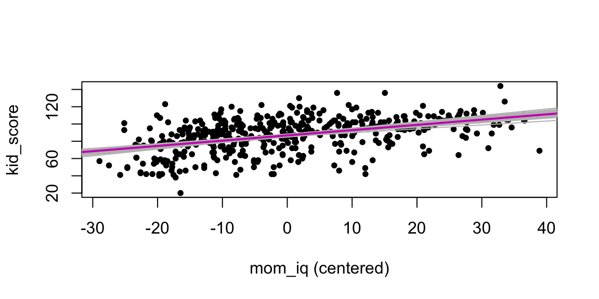
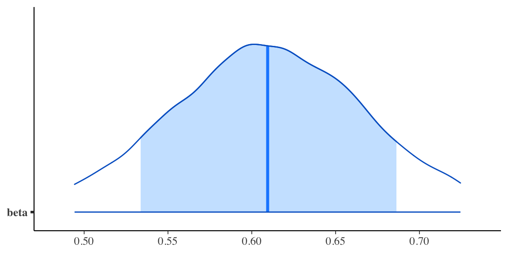
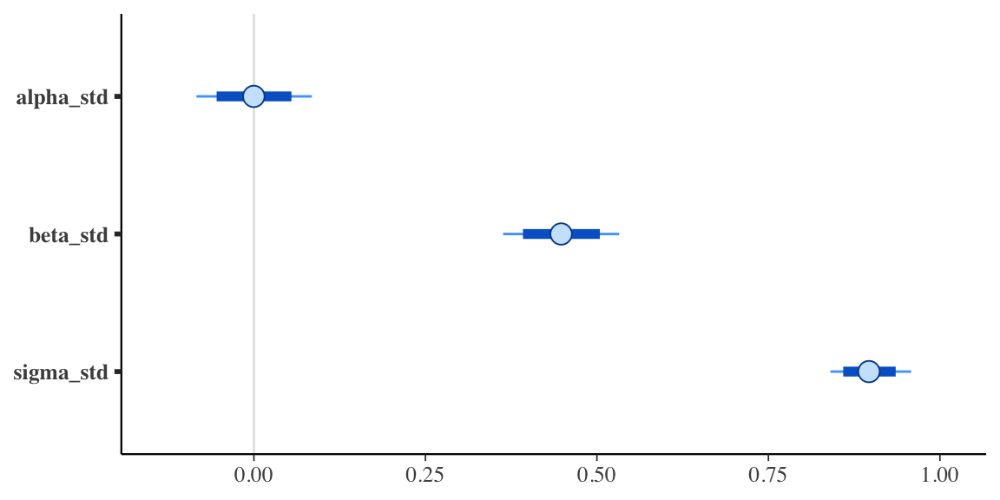
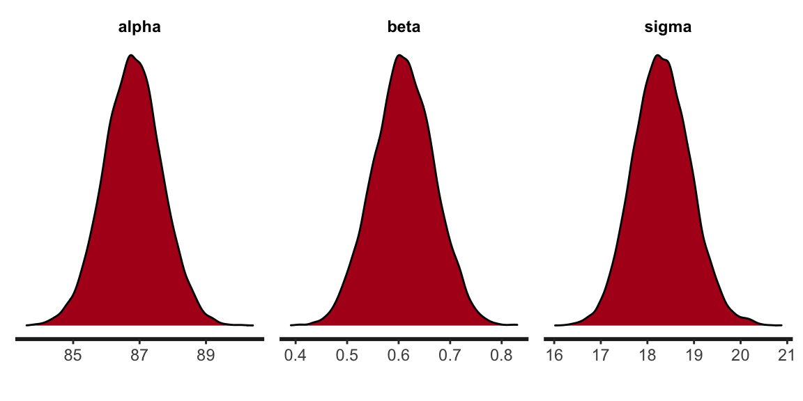

# Inferenza sul modello di regressione


I minimi quadrati o la massima verosimiglianza trovano i parametri che meglio si adattano ai dati (secondo un criterio prestabilito), ma senza altrimenti vincolare la stima. Ma di solito il ricercatore dispone di informazioni preliminari sui parametri del modello. L'inferenza bayesiana produce un compromesso tra tali informazioni precedenti e i dati, moltiplicando la funzione di verosimiglianza con una distribuzione a priori che codifica probabilisticamente le informazioni sui parametri possedute dal ricercatore prima di avere osservato i dati. Il prodotto della verosimiglianza \@ref(eq:ml-reg) e della distribuzione a priori è chiamata distribuzione a posteriori e riassume la nostra conoscenza del parametro _dopo_ aver visto i dati. 

La soluzione dei minimi quadrati è una stima puntuale che rappresenta il vettore dei coefficienti che fornisce il miglior adattamento complessivo ai dati. Per un modello bayesiano, la stima puntuale corrispondente è la _moda a posteriori_, che fornisce il miglior adattamento complessivo ai dati e alla distribuzione a priori. Si noti inoltre che la stima dei minimi quadrati (o di massima verosimiglianza) corrisponde alla moda a posteriori di un modello bayesiano con una distribuzione a priori uniforme.


## Rappresentazione grafica dell'incertezza della stima

Un primo modo per rappresentare l'incertezza dell'inferenza in un ottica bayesiana è quella di rappresentare graficamente la retta di regressione. Continuando con l'esempio descritto nel Capitolo precedente (ovvero, i dati `kid_score` e `mom_iq` centrati), usando la funzione `extract()`, salvo le stime a posteriori dei parametri in  formato `list`:


```r
stanfit <- rstan::read_stan_csv(fit2$output_files())
posterior <- extract(stanfit)
```

Un diagramma a dispersione dei dati con sovrapposto il valore atteso della $y$ in base al modello bayesiano si ottiene nel modo seguente:


```r
plot(
  df$kid_score ~ I(df$mom_iq - mean(df$mom_iq)), 
  pch = 20,
  xlab = "mom_iq (centered)",
  ylab = "kid_score"
)
abline(mean(posterior$alpha), mean(posterior$beta), col = 6, lw = 2)
```


Un modo per visualizzare l'incertezza della stima della retta di regressione è quello di tracciare molteplici rette di regressione, ciascuna delle quali definita da una diversa stima dei parametri $\alpha$ e $\beta$ che vengono estratti a caso dalle rispettive distribuzioni a posteriori.


```r
plot(
  df$kid_score ~ I(df$mom_iq - mean(df$mom_iq)), 
  pch = 20,
  xlab = "mom_iq (centered)",
  ylab = "kid_score"
)
for (i in 1:50) {
 abline(posterior$alpha[i], posterior$beta[i], col = "gray", lty = 1)
}
abline(mean(posterior$alpha), mean(posterior$beta), col = 6, lw = 2)
```




## Intervalli di credibilità

L'incertezza inferenziale sui parametri può essere rappresentata mediante gli _intervalli di credibilità_, ovvero gli intervalli che contengono la quota desiderata (es., il 95%) della distribuzione a posteriori.

Gli intervalli di credibilità al 95% si ottengono nel modo seguente:


```r
posterior <- extract(stanfit)
rstantools::posterior_interval(as.matrix(stanfit), prob = 0.95)
#>                    2.5%         97.5%
#> alpha_std   -0.08381793    0.08454522
#> beta_std     0.36326418    0.53240170
#> sigma_std    0.84043118    0.95801893
#> alpha       85.08649000   88.52285250
#> beta         0.49429853    0.72444565
#> sigma       17.15376250   19.55382000
#> lp__      -172.82802500 -168.24900000
```

Un grafico che riporta l'intervallo di credibilità ai livelli di probabilità desiderati per $\beta$ si ottiene con le seguenti istruzioni:


```r
mcmc_areas(
  fit2$draws(c("beta")),
  prob = 0.8,
  prob_outer = 0.95
  )
```



Per i parametri ottenuti analizzando i dati standardizzati, abbiamo


```r
stanfit %>%
  mcmc_intervals(
    pars = c("alpha_std", "beta_std", "sigma_std"), 
    prob = 0.8,
    prob_outer = 0.95
  )
```




## Rappresentazione grafica della distribuzione a posteriori

Ma non c'è niente di "magico" o necessario relativamente al livello di 0.95: il valore di 0.95 è arbitrario. Sono possibili tantissime altre soglie per quantificare la nostra incertezza: alcuni ricercatori usano il livello di 0.89, altri quello di 0.5. Se l'obiettivo è quello di descrivere il livello della nostra incertezza relativamente alla stima del parametro, allora dobbiamo riconoscere che la nostra incertezza è descritta dall'*intera* distribuzione a posteriori. Per cui il metodo più semplice, più diretto e più completo per descrivere la nostra incertezza rispetto alla stima dei parametri è quello di riportare graficamente tutta la distribuzione a posteriori. 

Una rappresentazione della distribuzione a posteriori dei parametri del modello che stiamo discutendo si ottiene nel modo seguente:


```r
stan_dens(stanfit, pars = c("alpha", "beta", "sigma"))
```




## Test di ipotesi

È facile valutare ipotesi direzionali. Per esempio, la probabilità di $\hat{\beta} > 0$ è


```r
sum(posterior$beta > 0) / length(posterior$beta)
#> [1] 1
```


## Regressione robusta

Spesso i ricercatori devono affrontare il problema degli outlier: un modello statistico basato sulla distribuzione Normale produrrà delle stime dei parametri che non si generalizzano ad altri campioni di dati (ovvero, campioni outlier con le stesse proprietà come nel campione esaminato). Il metodo tradizoinale per affrontare questo problema è quello di eliminare gli outlier prima di eseguire l'analisi statistica. Questo approccio ha però il problema che il criterio utilizzato per eliminare gli outlier, quale esso sia, non può che essere arbitrario. Dunque, usando criteri diversi per eliminare gli outlier i ricercatori finiscno per trovare risultati diversi.

Questo problema trova una semplice soluzione se viene usato l'approccio bayesiano. Nel modello di regressione che abbiamo dicusso finora è stato ipotizzato che gli errori seguono la distribuzione Normale. Per un modello formulato in questi termini, la presenza di solo un valore anomalo e influente può avere un effetto drammatico sulle stime dei parametri. Per fare un esempio, introduco nel set dei dati un singlo valore anomalo:


```r
df2 <- df
df2$kid_score[434] <- -500
df2$mom_iq[434] <- 140
```

Per comodità, calcoliamo le stime di $\alpha$ e $\beta$ con il metodo dei minimi quadrati (i risultati sono identici a quelli di un modello bayesiano normale con distribuzioni a priori vagamente informative). Sappiamo che, nel campione originari di dati, $\hat{\beta} \approx 0.6$. In presenza di un solo outlier troviamo che 


```r
summary(lm(kid_score ~ mom_iq, data = df2))
#> 
#> Call:
#> lm(formula = kid_score ~ mom_iq, data = df2)
#> 
#> Residuals:
#>     Min      1Q  Median      3Q     Max 
#> -599.95  -11.00    4.69   13.64   47.77 
#> 
#> Coefficients:
#>             Estimate Std. Error t value Pr(>|t|)    
#> (Intercept)  49.1880    11.0665   4.445 1.12e-05 ***
#> mom_iq        0.3626     0.1093   3.317 0.000987 ***
#> ---
#> Signif. codes:  
#> 0 '***' 0.001 '**' 0.01 '*' 0.05 '.' 0.1 ' ' 1
#> 
#> Residual standard error: 34.38 on 432 degrees of freedom
#> Multiple R-squared:  0.02483,	Adjusted R-squared:  0.02258 
#> F-statistic:    11 on 1 and 432 DF,  p-value: 0.0009872
```

\noindent
la stima di $\beta$ viene drammaticamente ridotta (di quasi la metà!). 

Un modello che assume una distribuzione Normale dei residui non è l'unico possibile.  È altrettanto valido un modello che ipotizza che i residui seguano una diversa distribuzione di densità. Per esempio, la distribuzione $t$ di Student con un piccolo numero di gradi di libertà. Una caratteristica della $t$ di Student è che le code della distribuzione contengono una massa di probabilità maggiore della Normale. Ciò fornisce alla $t$ di Student la possibilità di "rendere conto" della presenza di osservazioni lontane dalla media della distribuzione. In altri termini, se usiamo la $t$ di Student quale distribuzione dei residui in modello di regressione, ci aspettiamo che le stime dei parametri risultino meno influenzate dalla presenza di outlier di quanto avvenga nel modello Normale.

Per verificare questa intuizione, modifichiamo il codice Stan del modello usato in precedenza. L'unico cambiamento riguarda il fatto che, in questo caso, la distribuzione della $y$ viene ipotizzata seguire una $t$ di Student con un numero $\nu$ gradi di libertà stimato dal modello: `student_t(nu, mu, sigma)`.


```r
modelString = "
data {
  int<lower=0> N;
  vector[N] y;
  vector[N] x;
}
transformed data {
  vector[N] x_std;
  vector[N] y_std;
  x_std = (x - mean(x)) / sd(x);
  y_std = (y - mean(y)) / sd(y);
}
parameters {
  real alpha_std;
  real beta_std;
  real<lower=0> sigma_std;
  real<lower=1> nu;    // degrees of freedom is constrained >1
}
model {
  alpha_std ~ normal(0, 2);
  beta_std ~ normal(0, 2);
  sigma_std ~ cauchy(0, 2);
  nu ~ gamma(2, 0.1);   // Juárez and Steel(2010)
  y_std ~ student_t(nu, alpha_std + beta_std * x_std, sigma_std);
}
generated quantities {
  real alpha;
  real beta;
  real<lower=0> sigma;
  alpha = sd(y) * (alpha_std - beta_std * mean(x) / sd(x))
           + mean(y);
  beta = beta_std * sd(y) / sd(x);
  sigma = sd(y) * sigma_std;
}
"
writeLines(modelString, con = "code/simpleregstdrobust.stan")
```

\noindent
Costruiamo la lista dei dati usando il data.frame `df2` che include l'outlier:


```r
data3_list <- list(
  N = length(df2$kid_score),
  y = df2$kid_score,
  x = df2$mom_iq - mean(df2$mom_iq)
)
```

\noindent
Adattiamo il modello di regressione robusta ai dati:


```r
file <- file.path("code", "simpleregstdrobust.stan")
mod <- cmdstan_model(file)

fit4 <- mod$sample(
  data = data3_list,
  iter_sampling = 4000L,
  iter_warmup = 2000L,
  seed = SEED,
  chains = 4L,
  parallel_chains = 2L,
  refresh = 0,
  thin = 1
)
```

\noindent
Esaminando le stime dei parametri


```r
fit4$summary(c("alpha", "beta", "sigma", "nu"))
#> # A tibble: 4 × 10
#>   variable   mean median     sd    mad     q5    q95  rhat
#>   <chr>     <dbl>  <dbl>  <dbl>  <dbl>  <dbl>  <dbl> <dbl>
#> 1 alpha    87.8   87.8   0.887  0.899  86.3   89.3    1.00
#> 2 beta      0.603  0.603 0.0585 0.0577  0.506  0.698  1.00
#> 3 sigma    15.9   15.9   0.806  0.812  14.6   17.3    1.00
#> 4 nu        5.58   5.44  1.15   1.11    3.94   7.65   1.00
#> # … with 2 more variables: ess_bulk <dbl>, ess_tail <dbl>
```

\noindent
notiamo che la stima di $\beta$ è rimasta praticamente immutata. La regressione "robusta" non risente dunque della presenza degli outlier.

