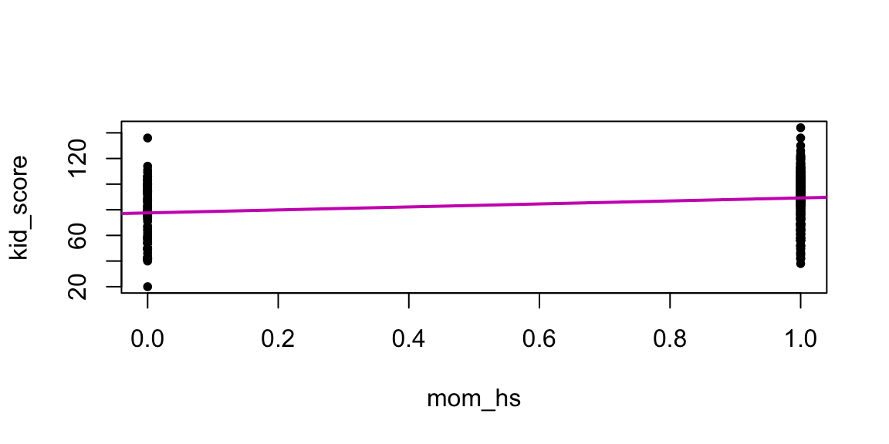

# Confronto tra due gruppi indipendenti


Il problema del confronto tra due gruppi indipendenti può essere formulato nei termini di un modello di regressione nel quale la variabile $x$ è dicotomica, ovvero assume solo due valori. 


## Regressione lineare con una variabile dicotomica

Se $x$ è una variabile dicotomica con valori 0 e 1, allora per il modello di regressione $\mu_i = \alpha + \beta x_i$ abbiamo quanto segue. Quando $x=0$, il modello diventa 

$$\mu_i = \alpha$$
\noindent
mentre, quando $X=1$, il modello diventa

$$\mu_i = \alpha + \beta.$$
\noindent
Ciò significa che il parametro $\alpha$ è uguale alla media del gruppo codificato con $X=0$ e il parametro $\beta$ è uguale alla differenza tra le medie dei due gruppi (essendo la media del secondo gruppo uguale a $\alpha + \beta$). Il parametro $\beta$, dunque, codifica l'effetto di una manipolazione sperimentale o di un trattamento, e l'inferenza su $\beta$ corrisponde direttamente all'inferenza sull'efficacia di un trattamento. Per "effetto di un trattamento" si intende la differenza tra le medie di due gruppi (per esempio, il gruppo "sperimentale" e il gruppo "di controllo"). L'inferenza su $\beta$, dunque, viene utilizzata per capire quanto "robusto" può essere considerato l'effetto di un trattamento o di una manipolazione sperimentale.

Esaminiamo nuovamente un sottoinsieme di dati tratto dal _National Longitudinal Survey of Youth_ i quali sono stati discussi da @gelman2020regression. I soggetti sono bambini di 3 e 4 anni. La variabile dipendente, `kid_score`, è il punteggio totale del _Peabody Individual Achievement Test_ (PIAT) costituito dalla somma dei punteggi di tre sottoscale (Mathematics, Reading comprehension, Reading recognition). La variabile indipendente, `mom_hs`, è il livello di istruzione della madre, codificato con due livelli: scuola media superiore completata oppure no. La domanda della ricerca è se il QI del figlio (misurato sulla scala PIAT) risulta o meno associato al livello di istruzione della madre.

Codifichiamo il livello di istruzione della madre ($x$) con una _variabile indicatrice_ (ovvero, una variabile che assume solo i valori 0 e 1) tale per cui:

- $x=0$: la madre non ha completato la scuola secondaria di secondo grado (scuola media superiore);

- $x=1$: la madre ha completato la scuola media superiore.

\noindent
Supponiamo che i dati siano contenuti nel data.frame `df`. 


```r
library("foreign")
df <- read.dta(here("data", "kidiq.dta"))
```

\noindent
Calcoliamo le statistiche descrittive per i due gruppi:


```r
df %>% 
  group_by(mom_hs) %>% 
  summarise(
    mean_kid_score = mean(kid_score),
    std = sqrt(var(kid_score))
  )
#> # A tibble: 2 × 3
#>   mom_hs mean_kid_score   std
#>    <dbl>          <dbl> <dbl>
#> 1      0           77.5  22.6
#> 2      1           89.3  19.0
```

\noindent
Il punteggio medio PIAT è pari a 77.5 per i bambini la cui madre non ha il diploma di scuola media superiore e pari a 89.3 per i bambini la cui madre ha completato la scuola media superiore. Questa differenza suggerisce un'associazione tra le variabili, ma tale differenza potrebbe essere soltanto la conseguenza della variabilità campionaria, senza riflettere una caratteristica generale della popolazione. Come possiamo usare il modello statistico lineare per fare inferenza sulla differenza osservata tra i due gruppi? Non dobbiamo fare nient'altro che usare lo stesso modello di regressione che abbiamo definito in precedenza.


```r
modelString = "
data {
  int<lower=0> N;
  vector[N] y;
  vector[N] x;
}
transformed data {
  vector[N] x_std;
  vector[N] y_std;
  x_std = (x - mean(x)) / sd(x);
  y_std = (y - mean(y)) / sd(y);
}
parameters {
  real alpha_std;
  real beta_std;
  real<lower=0> sigma_std;
}
model {
  alpha_std ~ normal(0, 2);
  beta_std ~ normal(0, 2);
  sigma_std ~ cauchy(0, 2);
  y_std ~ normal(alpha_std + beta_std * x_std, sigma_std);
}
generated quantities {
  real alpha;
  real beta;
  real<lower=0> sigma;
  alpha = sd(y) * (alpha_std - beta_std * mean(x) / sd(x))
           + mean(y);
  beta = beta_std * sd(y) / sd(x);
  sigma = sd(y) * sigma_std;
}
"
writeLines(modelString, con = "code/simpleregstd.stan")
```

\noindent
Come in precedenza, salviamo i dati in un oggetto di classe `list`:


```r
data_list <- list(
  N = length(df$kid_score),
  y = df$kid_score,
  x = df$mom_hs
)
```

\noindent
Compiliamo il modello:


```r
file <- file.path("code", "simpleregstd.stan")
mod <- cmdstan_model(file)
```

\noindent
Adattiamo il modello ai dati:


```r
fit <- mod$sample(
  data = data_list,
  iter_sampling = 4000L,
  iter_warmup = 2000L,
  seed = SEED,
  chains = 4L,
  parallel_chains = 2L,
  refresh = 0,
  thin = 1
)
```


```r
stanfit <- rstan::read_stan_csv(fit$output_files())
posterior <- extract(stanfit)
```


```r
plot(
  df$kid_score ~ df$mom_hs, 
  pch = 20,
  xlab = "mom_hs",
  ylab = "kid_score"
)
abline(mean(posterior$alpha), mean(posterior$beta), col = 6, lw = 2)
```



\noindent
Le stime a posteriori dei parametri si ottengono con:


```r
fit$summary(c("alpha", "beta", "sigma"))
#> # A tibble: 3 × 10
#>   variable  mean median    sd   mad    q5   q95  rhat
#>   <chr>    <dbl>  <dbl> <dbl> <dbl> <dbl> <dbl> <dbl>
#> 1 alpha     77.5   77.6 2.07  2.06  74.2   81.0  1.00
#> 2 beta      11.8   11.8 2.34  2.33   7.91  15.6  1.00
#> 3 sigma     19.9   19.9 0.679 0.673 18.8   21.0  1.00
#> # … with 2 more variables: ess_bulk <dbl>, ess_tail <dbl>
```

\noindent
I risultati confermano ciò che ci aspettavamo: 

- il coefficiente $\texttt{alpha} = 77.56$ corrisponde alla media del gruppo codificato con $x = 0$, ovvero la media dei punteggi PIAT per i bambini la cui madre non ha completato la scuola media superiore; 
- il coefficiente $\texttt{beta} = 11.76$ corrisponde alla differenza tra le medie dei due gruppi, ovvero 89.32 - 77.55 = 11.77 (con piccoli errori di approssimazione). 

\noindent
Possiamo ottenere l'intervallo di credibilità al 95% per $\texttt{beta}$:


```r
rstantools::posterior_interval(as.matrix(stanfit), prob = 0.95)
#>                   2.5%         97.5%
#> alpha_std   -0.0903768    0.09155991
#> beta_std     0.1446650    0.32894522
#> sigma_std    0.9120478    1.04369125
#> alpha       73.4853725   81.60923250
#> beta         7.1877393   16.34371250
#> sigma       18.6154975   21.30252500
#> lp__      -209.0430250 -204.32200000
```

Il coefficiente $b$ ci dice che i bambini la cui madre ha completato la scuola superiore ottengono in media circa 12 punti in più rispetto ai bambini la cui madre non ha completato la scuola superiore. L'intervallo di credibilità al 95% ci dice che possiamo essere sicuri al 95% che tale differenza è di almeno 7 punti e può arrivare fino a ben 16 punti. Possiamo dunque concludere, con un grado di certezza soggettiva del 95%, che c'è un'associazione tra il livello di scolarità della madre e l'intelligenza del bambino: i bambini tendono ad avere un livello di intelligenza più elevato se le loro madri hanno un livello di istruzione maggiore.


## La dimensione dell'effetto

Avendo a disposizione le informazioni sulle distribuzioni a posteriori dei parametri è facile calcolare la dimensione dell'effetto nei termini del $d$ di Cohen:


```r
11.75398 / 19.90159	
#> [1] 0.5906051
```

\noindent
Nei termini del $d$ di Cohen possiamo dunque concludere che la grandezza dell'effetto è di entità "media" [$d$ > 0.5; x@sawilowsky2009new]. 

